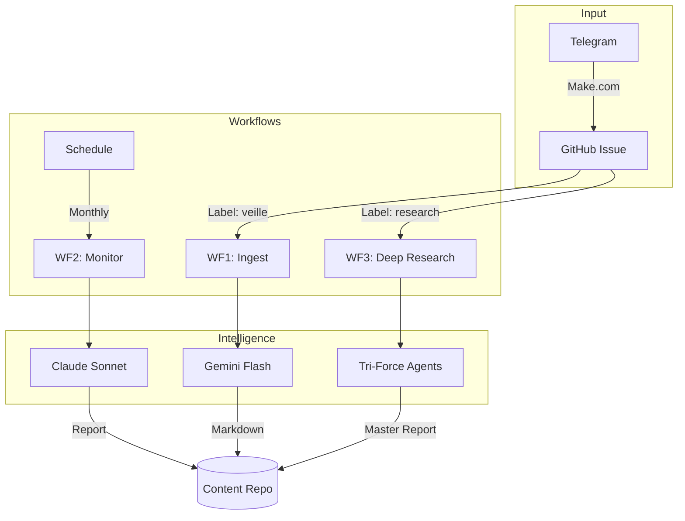

# ResearchOps v1.1 (Expert Edition)

**Serverless Multi-Modal Intelligence Pipeline for R&D & Process Engineering**

ResearchOps is an automated intelligence system designed for R&D Managers and Engineers. It acts as a "Second Brain", ingesting technical content from various sources (Web, PDF, Images) and synthesizing it into actionable insights using advanced LLMs.

## 🚀 Features

*   **Omni-Channel Ingest (WF1):** Send URLs, Text, Images (Screenshots), or PDFs via Telegram. The system automatically analyzes, categorizes, and summarizes them into Markdown.
*   **Strategic Monitor (WF2):** Monthly hybrid intelligence report combining your field captures (Internal) with fresh web/academic search results (External).
*   **Deep Research (WF3):** Autonomous multi-agent research system ("Tri-Force") that combines Perplexity (Market/News), Gemini+Tavily (Tech/Engineering), and Claude Opus (Strategic Synthesis) to produce master-level reports on complex topics.
*   **Zero-Infra:** Runs entirely on GitHub Actions. No servers to manage.
*   **Expert Analysis:** Prompts tuned for Industrial ROI, Feasibility, and Innovation.

## 🛠 Architecture

## 📂 Project Structure

*   `src/`: Python source code for workflows.
    *   `wf1_ingest.py`: Daily ingestion logic.
    *   `wf2_monitor.py`: Monthly strategic monitoring.
    *   `wf3_triforce.py`: Deep research orchestration.
    *   `agents/`: AI Agents for WF3 (Perplexity, Gemini, Claude).
    *   `utils/`: Helper modules.
*   `config/`: Configuration files.
*   `content/`: Stored intelligence (Markdown files).
*   `reports/`: Generated monthly reports.
*   `research/`: Deep research master reports.
*   `docs/`: Detailed documentation.

## 🚦 Setup & Usage

### 1. Initial Setup
1.  **Secrets:** Configure API Keys (Google, Anthropic, Perplexity, Tavily, Telegram) in GitHub Secrets.
2.  **Make.com:** Set up the Telegram to GitHub bridge (see [docs/make_setup.md](docs/make_setup.md)).

### 2. How to Run the Workflows

| Workflow | Trigger Type | How to Launch |
| :--- | :--- | :--- |
| **WF1: Ingest** | **Automatic** | Send a message/file to your **Telegram Bot**. Make.com creates an issue with label \`veille\`. |
| **WF2: Monitor** | **Scheduled / Manual** | Runs automatically on the **1st of the month**. Can be triggered manually via **GitHub Actions** tab (\`Run workflow\`). |
| **WF3: Research** | **Manual (Issue)** | Create a **GitHub Issue** with label \`research\`.  • **Title:** Research Topic (e.g., "Solid State Batteries") • **Body:** (Optional) Specific questions, context, or constraints. |

### 3. Detailed Triggers
*   **WF1 (Daily Watch):** Triggered by any Issue labeled \`veille\`.
*   **WF2 (Monthly Report):** Triggered by CRON \`0 6 1 * *\` or \`workflow_dispatch\`.
*   **WF3 (Deep Research):** Triggered by any Issue labeled \`research\`.
    *   **Pro Tip:** Use the Issue Body to guide the agents (e.g., "Focus on European market", "Ignore patents before 2020").

## 📚 Documentation

*   [Make.com Setup Guide](docs/make_setup.md)
*   [Workflow 1: Ingestion Details](docs/wf1_ingest.md)
*   [Workflow 2: Monitoring Details](docs/wf2_monitor.md)
*   [Workflow 3: Deep Research Details](docs/wf3_deep_research.md)

## 👤 Author

**Younes** - R&D Manager / Process Engineering Expert / Data Engineer
