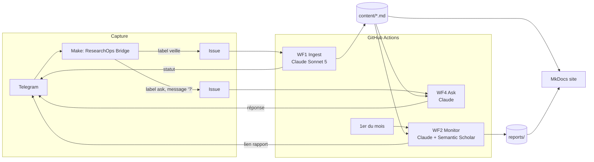

# ResearchOps v1.2

**Second cerveau R&D, sans serveur : Telegram → GitHub Actions → fiches Markdown classées, rapport mensuel, questions-réponses.**

ResearchOps ingère ce que vous lui envoyez (URL, texte, capture d'écran, PDF), le transforme en fiche technique classée par catégorie métier, synthétise vos captures chaque mois avec les publications récentes, et répond à vos questions à partir de votre propre base.

## Fonctionnalités

| Workflow | Déclencheur | Ce qu'il fait |
|---|---|---|
| **WF1 · Ingest** | Message au bot Telegram (via Make) ou issue `veille` | Garde-fou qualité (404, anti-bot, contenu vide, PII), dédup par hash de contenu, analyse Claude, fiche Markdown dans `content/<Catégorie>/`, notification Telegram |
| **WF2 · Monitor** | Le 1er du mois, ou manuel | Synthèse Claude des captures du mois + nouvelles publications Semantic Scholar sur vos thèmes, rapport cité `[I n]`/`[P n]` dans `reports/` |
| **WF4 · Ask** | Message Telegram commençant par `?` ou issue `ask` | Sélectionne les fiches pertinentes, répond en français avec citations, poste la réponse sur Telegram et dans l'issue |
| **Site** | Push sur `main` | Publie `content/` et `reports/` en site MkDocs Material (recherche plein texte, tags, LaTeX, Mermaid) |

WF3 « Tri-Force » (recherche multi-agents) a été retiré : jamais utilisé, et dominé par les produits Deep Research (Perplexity, Gemini, Claude). Envoyez leur rapport au bot pour l'archiver via WF1. Le code est conservé dans `legacy/`.

## Architecture


```mermaid
graph LR
    subgraph Capture
        TG[Telegram] --> MK[Make: ResearchOps Bridge]
        MK -->|label veille| I1[Issue]
        MK -->|label ask, message '?'| I2[Issue]
    end
    subgraph "GitHub Actions"
        I1 --> WF1[WF1 Ingest<br/>Claude Sonnet 5]
        I2 --> WF4[WF4 Ask<br/>Claude]
        CRON[1er du mois] --> WF2[WF2 Monitor<br/>Claude + Semantic Scholar]
    end
    WF1 --> C[(content/*.md)]
    C --> WF2 --> R[(reports/)]
    C --> WF4 -->|réponse| TG
    C --> SITE[MkDocs site]
    R --> SITE
    WF1 -->|statut| TG
    WF2 -->|lien rapport| TG
```

## Structure

```
src/
  wf1_ingest.py        ingestion + garde-fou + fiche
  wf2_monitor.py       rapport mensuel
  wf4_ask.py           questions-réponses sur la base
  utils/
    content_guard.py   validation avant/après LLM
    dedup.py           historique URL + hash de contenu
    frontmatter.py     lecture/écriture YAML des fiches
    git_ops.py         commit + push avec retry
    notify.py          Telegram, commentaires d'issue, outputs Actions
    logger.py          logs JSON en CI
config/
  categories.json      taxonomie + seuils (confidence 0.6, reject 0.3)
  monitoring.json      thèmes de veille académique
content/               fiches (sortie WF1)
reports/               rapports mensuels (sortie WF2)
scripts/build_site.py  assemblage du site
legacy/                code retiré (WF3, stub Triforce), à supprimer
docs/                  documentation détaillée
```

## Mise en place

1. **Secrets GitHub** : `ANTHROPIC_API_KEY`, `TELEGRAM_BOT_TOKEN`, `TELEGRAM_CHAT_ID`. Optionnel : `SEMANTIC_SCHOLAR_API_KEY`.
2. **Make** : scénario Telegram → GitHub, voir [docs/make_setup.md](docs/make_setup.md). Le token GitHub doit être stocké dans une clé Make (keychain), jamais dans un module.
3. **Site** : Settings → Pages → Source « Deploy from a branch », branche `gh-pages`. Le workflow `docs_site.yml` publie à chaque push sur `main`.
4. **Local** : `cp .env.example .env`, `pip install -r requirements.txt`, `python -m pytest`.

## Utilisation

| Action | Comment |
|---|---|
| Capturer | Envoyer au bot : une URL, un texte, une photo, un PDF |
| Interroger | Envoyer au bot un message commençant par `?` : `? qu'ai-je capturé sur les PINN ?` |
| Rapport mensuel | Automatique le 1er ; manuel via Actions → « WF2 - Monthly Monitor » → Run workflow |
| Consulter | Site publié, ou ouvrir le dépôt comme vault Obsidian |

Les issues rejetées par le garde-fou sont fermées avec la raison (`🚫`), les doublons avec `♻️`.

## Documentation

- [Make.com : pont Telegram → GitHub](docs/make_setup.md)
- [WF1 : ingestion](docs/wf1_ingest.md)
- [WF2 : rapport mensuel](docs/wf2_monitor.md)
- [WF4 : questions-réponses](docs/wf4_ask.md)
- [Site de consultation](docs/knowledge_base_site.md)
- [Spécification v1.2](context/specification.md)

## Auteur

**Younes AJEDDIG** Ph.D — R&D Manager / Process Modeling & Simulation / Data Engineer & Scientist
