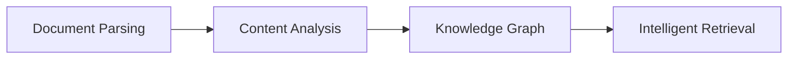

## 🎯 Relevance
This framework is highly useful for industrial applications requiring intelligent processing and querying of complex, multimodal technical documentation, operational reports, and research data. It enables advanced knowledge management, improved decision-making, and automation of information retrieval from diverse data sources, ultimately enhancing operational efficiency and innovation within process engineering and industrial data science contexts.

## 📖 Content
RAG-Anything is presented as a comprehensive "All-in-One Multimodal Document Processing RAG system" designed to address the limitations of traditional text-focused RAG systems when dealing with diverse multimodal content such as text, images, tables, equations, charts, and multimedia. Built on the LightRAG framework, it aims to provide seamless processing and querying across all content modalities within a single integrated framework, eliminating the need for multiple specialized tools.

**System Overview: Next-Generation Multimodal Intelligence**
Modern documents increasingly contain diverse multimodal content. RAG-Anything offers comprehensive multimodal retrieval capabilities, allowing users to query documents with interleaved text, visual diagrams, structured tables, and mathematical formulations through one cohesive interface. This makes it valuable for academic research, technical documentation, financial reports, and enterprise knowledge management.

**Key Features:**
*   **🔄 End-to-End Multimodal Pipeline**: Complete workflow from document ingestion and parsing to intelligent multimodal query answering.
*   **📄 Universal Document Support**: Seamless processing of PDFs, Office documents (DOC/DOCX/PPT/PPTX/XLS/XLSX), images, and diverse file formats.
*   **🧠 Specialized Content Analysis**: Dedicated processors for images, tables, mathematical equations, and heterogeneous content types.
*   **🔗 Multimodal Knowledge Graph**: Automatic entity extraction and cross-modal relationship discovery for enhanced understanding.
*   **⚡ Adaptive Processing Modes**: Flexible MinerU-based parsing or direct multimodal content injection workflows.
*   **📋 Direct Content List Insertion**: Bypass document parsing by directly inserting pre-parsed content lists from external sources.
*   **🎯 Hybrid Intelligent Retrieval**: Advanced search capabilities spanning textual and multimodal content with contextual understanding.

**Algorithm & Architecture: Core Algorithm**
RAG-Anything implements a multi-stage multimodal pipeline that extends traditional RAG architectures to handle diverse content modalities through intelligent orchestration and cross-modal understanding. The pipeline consists of:



**1. Document Parsing Stage:**
Provides high-fidelity document extraction through adaptive content decomposition, segmenting heterogeneous elements while preserving contextual relationships. It offers universal format compatibility via specialized optimized parsers.
*   **⚙️ MinerU Integration**: Leverages [MinerU](https://github.com/opendatalab/MinerU) for high-fidelity document structure extraction and semantic preservation.
*   **🧩 Adaptive Content Decomposition**: Automatically segments documents into text blocks, visual elements, structured tables, mathematical equations, and specialized content types.
*   **📁 Universal Format Support**: Handles PDFs, Office documents, images, and other formats.

**2. Multi-Modal Content Understanding & Processing:**
Automatically categorizes and routes content through optimized channels using concurrent pipelines for parallel text and multimodal processing. Document hierarchy and relationships are preserved.
*   **🎯 Autonomous Content Categorization and Routing**: Identifies, categorizes, and routes different content types.
*   **⚡ Concurrent Multi-Pipeline Architecture**: Implements concurrent execution of textual and multimodal content processing.
*   **🏗️ Document Hierarchy Extraction**: Extracts and preserves original document hierarchy and inter-element relationships.

**3. Multimodal Analysis Engine:**
Deploys modality-aware processing units for heterogeneous data modalities:
*   **🔍 Visual Content Analyzer**: Integrates vision models for image analysis, generates context-aware descriptive captions, and extracts spatial relationships.
*   **📊 Structured Data Interpreter**: Performs systematic interpretation of tabular and structured data, implements statistical pattern recognition, and identifies semantic relationships.
*   **📐 Mathematical Expression Parser**: Parses complex mathematical expressions and formulas with high accuracy, provides native LaTeX format support, and establishes conceptual mappings.
*   **🔧 Extensible Modality Handler**: Provides a configurable processing framework for custom and emerging content types via a plugin architecture.

**4. Multimodal Knowledge Graph Index:**
Transforms document content into structured semantic representations, extracts multimodal entities, establishes cross-modal relationships, and preserves hierarchical organization. Applies weighted relevance scoring for optimized knowledge retrieval.
*   **🔍 Multi-Modal Entity Extraction**: Transforms significant multimodal elements into structured knowledge graph entities with semantic annotations.
*   **🔗 Cross-Modal Relationship Mapping**: Establishes semantic connections and dependencies between textual entities and multimodal components.
*   **🏗️ Hierarchical Structure Preservation**: Maintains original document organization through "belongs_to" relationship chains.
*   **⚖️ Weighted Relationship Scoring**: Assigns quantitative relevance scores to relationship types based on semantic proximity and contextual significance.

**5. Modality-Aware Retrieval:**
Combines vector similarity search with graph traversal algorithms for comprehensive content retrieval. Implements modality-aware ranking mechanisms and maintains relational coherence between retrieved elements.
*   **🔀 Vector-Graph Fusion**: Integrates vector similarity search with graph traversal algorithms, leveraging semantic embeddings and structural relationships.
*   **📊 Modality-Aware Ranking**: Implements adaptive scoring mechanisms that weight retrieval results based on content type relevance and query-specific modality preferences.
*   **🔗 Relational Coherence Maintenance**: Maintains semantic and structural relationships between retrieved elements for coherent information delivery.

**Installation (Option 1: Install from PyPI)**:
```python
pip install raganything
```

## 💡 Key Insights
- RAG-Anything is an all-in-one multimodal RAG framework designed to process and query diverse content types including text, images, tables, and mathematical equations.
- The framework employs a multi-stage pipeline: Document Parsing, Multimodal Content Understanding, Multimodal Analysis Engine, Multimodal Knowledge Graph Index, and Modality-Aware Retrieval.
- It features specialized analyzers for visual content, structured data, and mathematical expressions, with native LaTeX support.
- A Multimodal Knowledge Graph is constructed to extract entities, map cross-modal relationships, and preserve document hierarchy for enhanced understanding and retrieval.
- The retrieval mechanism utilizes a hybrid approach combining vector similarity search and graph traversal, incorporating modality-aware ranking for contextual relevance.

## 📚 References
- HKUDS. (n.d.). RAG-Anything: All-in-One RAG Framework. GitHub. Retrieved from https://github.com/HKUDS/RAG-Anything *(source)*
- arxiv.org/abs/2510.12323 (Technical Report for RAG-Anything) *(cited)*
- HKUDS. (n.d.). LightRAG. GitHub. Retrieved from https://github.com/HKUDS/LightRAG *(cited)*
- opendatalab. (n.d.). MinerU. GitHub. Retrieved from https://github.com/opendatalab/MinerU *(cited)*

## 🏷️ Classification
The content describes an advanced framework for Retrieval-Augmented Generation (RAG) that leverages machine learning, natural language processing, computer vision, and knowledge graph techniques to process and retrieve information from multimodal data, aligning with the core principles of Data Science.
