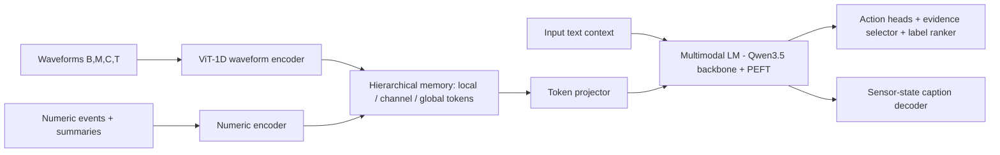

## 🎯 Relevance
Illustrates an emerging architecture for foundation-style models that fuse multichannel sensor time series, irregular events and language to output actions and explanations. It is a useful reference for industrial equivalents (operator-assist copilots, process alarm reasoning, time-series + LLM fusion), even though the released model is clinical-only and not directly applicable to process plants.

## 📖 Content
## Overview

OpenSLA is an open-source repository (MIT license, Python >= 3.10) for **Sensor-Language-Action (SLA) models**. A model takes a multi-channel sensor history plus language context and produces:

1. a **structured action prediction**, and
2. a **sensor-state caption**.

The concept is analogous to Vision-Language-Action models, but the perception input is physiological time series rather than images. The released application domain is healthcare (clinical decision support); the architecture itself is domain-agnostic.

## Model variants

| Variant | Sensor fusion strategy |
| --- | --- |
| **OpenSLA-B** (Base) | Sensor tokens are projected and prepended to the language prompt as a flat token prefix |
| **OpenSLA-H** (Hierarchical) | Adds a hierarchical sensor encoder compressing the signal into **local**, **per-channel** and **global** memory tokens |

Only **OpenSLA-H (clinical)** weights are currently published on HuggingFace. The download contains the model checkpoint, the waveform-encoder checkpoint, `numeric_config.json` and `action_group_types.json`.

## Architecture (from project structure)

```
OpenSLA/
├── src/opensla/
│   ├── inference.py   # input format, checkpoint loading, sensor fusion, OpenSLA.predict
│   ├── model.py       # action heads, evidence selector, label ranker, caption decoder, multimodal LM
│   ├── sensors.py     # waveform/numeric encoders, hierarchical signal memory, token projectors
│   ├── vit1d.py       # waveform-encoder backbone (adapted from OSF)
│   └── cli.py         # `opensla` command
```



Dependencies: PyTorch >= 2.5, Transformers >= 5.8.1 (Qwen3.5 backbone), PEFT >= 0.12 (parameter-efficient fine-tuning/LoRA-type adapters).

## Input format

A `.pt` dictionary with `domain`, `input_text` (one text context per sample) and `sensors`:

- **Waveform**: tensor `[B, M, C, T]`: M one-minute slots, C physical channels, T = 7500 samples per slot (60 s at 125 Hz). Also `waveform_channel_mask` `[B, M, C]` (boolean, marks observed channel-minutes, handling missing data) and `waveform_modality_ids` `[B, C]` (int64, index into `opensla.WAVEFORM_MODALITIES[domain]`).
- **Numeric (irregular events)**: parallel `[B, E]` tensors `values`, `rel_time_min` (minutes before the decision), `measure_ids`, `source_ids`, `event_mask`, plus per-measure summary features (`summary_features`, `summary_measure_ids`).

This is a useful pattern for mixing **high-rate regular waveforms** with **sparse irregular charted events** (labs, vitals) under a decision-time-relative clock.

## Usage

```python
import torch
from opensla import OpenSLA, SensorBatch

model = OpenSLA.from_checkpoint(
    "pretrained_weights/opensla_h_clinical.pt", domain="clinical",
    dino_checkpoint="pretrained_weights/waveform_encoder.ckpt",
    numeric_config="pretrained_weights/numeric_config.json",
    action_group_types="pretrained_weights/action_group_types.json",
)
batch = torch.load("data/preprocessed_batch.pt", weights_only=True)
predictions = model.predict(batch["input_text"], SensorBatch(**batch["sensors"]))
```

CLI:

```bash
opensla --config configs/template.json --dry-run   # print resolved config
opensla --config configs/template.json             # writes outputs/predictions.jsonl
sbatch --account=ACCT --partition=PART scripts/run_template.sbatch --config configs/template.json
```

The waveform encoder name `dino_checkpoint` suggests a self-supervised (DINO-style) pretrained encoder, adapted from OSF (Open Sleep Foundation Model).

## Datasets

| Dataset | Domain | Signals |
| --- | --- | --- |
| MC-MED | Clinical (ED) | ECG, PPG, respiration, arterial pressure; vitals, labs, ventilator |
| MIMIC-III | Clinical | same as MC-MED |
| MIMIC-IV | Clinical, external eval only | waveform-linked subset |
| MOVER | Operating room | ECG, PPG, arterial/CVP, capnography, airway pressure, EEG; hemodynamics, gases, labs |
| VitalDB | Operating room | same as MOVER |
| MetaboNet | CGM | glucose trace, basal insulin |
| PEDAP | CGM | glucose trace, basal insulin |

Six training/evaluation datasets across three healthcare settings (clinical, OR, continuous glucose monitoring), with MIMIC-IV as external held-out cohort.

## Citation

Xu, Y., Shuai, Z., Yang, Y., *Sensor-Language-Action Models*, arXiv:2610.08244, 2026.

## 💡 Key Insights
- SLA models extend the VLA paradigm to sensor time series: multi-channel sensor history + language context -> structured action + sensor-state caption.
- Two fusion designs: flat token prefix (OpenSLA-B) vs. hierarchical memory with local/per-channel/global tokens (OpenSLA-H), which compresses long high-rate signals into a manageable token budget.
- Input handling combines regular high-rate waveforms (60 s slots at 125 Hz, with channel-minute masks for missing data) and irregular numeric events indexed by relative time before the decision.
- Built on a pretrained LLM backbone (Qwen3.5) with PEFT adapters and a pretrained self-supervised waveform encoder (ViT-1D adapted from OSF).
- Only the clinical OpenSLA-H checkpoint is released; the pattern is transferable in principle to industrial sensor data but would need retraining and domain-specific action vocabularies.
- Heads include evidence selector, label ranker and caption decoder, giving some explainability (evidence + caption) alongside action predictions.

## 📚 References
- yang-ai-lab/OpenSLA GitHub repository, https://github.com/yang-ai-lab/OpenSLA *(source)*
- Xu Y., Shuai Z., Yang Y., Sensor-Language-Action Models, arXiv:2610.08244, 2026 *(cited)*
- OSF: Open Sleep Foundation Model, https://github.com/yang-ai-lab/OSF-Open-Sleep-FM (waveform encoder source) *(cited)*
- Datasets: MC-MED, MIMIC-III, MIMIC-IV (PhysioNet), MOVER, VitalDB, MetaboNet, PEDAP *(cited)*

## 🏷️ Classification
A GitHub repo for a sensor-language-action foundation model on physiological time series, best matching ML on sensor/time-series data and foundation models.
