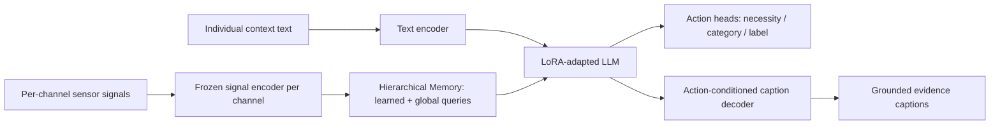

## 🎯 Relevance
Offers a template for turning multichannel time-series sensor data into explainable, action-oriented decisions with LLMs. Ideas such as per-channel frozen encoders, LoRA fusion, token compression for long recordings, and caption-based grounding could be carried over to industrial process monitoring and operator decision support (for example recommending control actions from historian data). The application shown here is healthcare, though, so it is a conceptual rather than directly industrial reference.

## 📖 Content
## Overview

OpenSLA (Yang AI Lab, Xu, Shuai, Yang; arXiv 2610.08244, 2026) is presented as the first general framework connecting **sensors, language and actions** in a single model. Conventional sensor models stop at perception (state recognition or outcome prediction), and the decisions that follow are modelled elsewhere as separate closed-label tasks. OpenSLA uses **language as a common interface** that encodes the question, the individual's context, the signal evidence and the meaning of an action. A bedside medication decision, a surgical intervention and an insulin bolus then become the same kind of problem.

From one sensor window plus individual context, the model:

1. **Decides** whether to act (necessity), what type of action (category) and which one (label).
2. **Describes** what the signals show (sensor-state understanding).
3. **Explains** the decision with grounded evidence (action-evidence captions).

## Task hierarchy

| Level | Question | Example |
|---|---|---|
| 1. Necessity | Act or not? | Yes |
| 2. Category | What type of action? | Antibiotics |
| 3. Label | Which one? | Imipenem |

Sensor-state understanding is split into three caption levels: **observational** (what each channel shows), **relational** (how channels agree) and **global** (findings in context). A fourth facet, **action evidence**, links the findings to the recorded action.

## Architecture

- **Encode every channel**: a text encoder for context and a frozen signal encoder per sensor channel.
- **Reason in the LLM**: a LoRA-adapted LLM reads both. Action heads predict, and an action-conditioned decoder explains.
- **Hierarchical Memory** (OpenSLA-H variant): learned queries compress long recordings across resolutions, and global queries keep the whole picture. It sits between the sensor encoder and the pretrained LLM.
- OpenSLA-B is the base variant without Hierarchical Memory.
- **Compared paradigms** (same data, same compute): VLA-style (action-only), SensorLM-style and fully supervised.

## Benchmark

Three care settings, six cohorts, sensor histories paired with context, structured actions and evidence captions:

| Setting | Datasets | Actions |
|---|---|---|
| Clinical care | MC-MED, MIMIC-III (MIMIC-IV as external test) | Medications, procedures, diagnostics |
| Operating room | MOVER, VitalDB | Perioperative interventions |
| Metabolic health | MetaboNet, PEDAP | Glucose and basal insulin; action = bolus |

## Reported results

- Best action-necessity balanced accuracy in all six cohorts and best category accuracy in five, against the strongest of eight baselines.
- **State-estimation MAE**: respiratory rate 1.17 (next best 5.87) in clinical data; EtCO2 3.18 (next best 5.47) in the operating room; carbohydrate amount 0.38 (next best 1.2) in CGM.
- **Grounded description**: OpenSLA captions reproduce quantitative statistics (HR median 100, range 97–104, n=30), whereas a zero-shot GPT-5.6-Luna baseline gives only a vague "HR approximately 90 bpm".
- **Zero-shot unseen action**: Imipenem was never a training target. OpenSLA-H reaches 71.4 balanced accuracy against 61.9 for the strongest baseline, and its embedding lies inside the antibiotics cluster in a PCA of action representations.
- **Continuous action space**: interpolating between embeddings of two insulin boluses (0.05 U and 14.4 U) and retrieving the nearest real sample gives 1.2 U at α=0.4 and 7.7 U at α=0.8. A readout of the future CGM state over two hours has the lowest MAE for OpenSLA.
- **External validation**: on MIMIC-IV with zero fine-tuning, 74.4 vs 69.3 necessity balanced accuracy against the best adapted baseline.

## Ablations

| Finding | Numbers |
|---|---|
| Action-only (VLA-style) training is weakest on every endpoint | VitalDB necessity AUROC 54.1 → 74.9 with captions + action conditioning |
| Adding action-evidence captions | MOVER 81.6 → 83.4; VitalDB 64.3 → 74.9 |
| Fusion: direct LoRA vs Flamingo-style cross-attention vs LLaVA-style projector | VitalDB necessity AUROC 74.9 vs 68.9 vs 54.4 |
| Hierarchical Memory efficiency | 14.5× fewer sensor tokens (clinical), 4.7× (OR); forward passes 3.4× and 1.7× faster |

Removing action conditioning or the fusion decoder still beats action-only training, and the full model wins all four operating-room endpoints.

## Takeaways

Language supervision (evidence captions) is a first-order design choice, not a side output. It improves both action prediction and signal grounding, and it gives zero-shot generalisation to unseen actions through a semantically structured action embedding space.

## 💡 Key Insights
- Language acts as a unifying interface: context, signals, and actions are all expressed as text, so heterogeneous decisions (medication, surgery, insulin) become one task type.
- Action-only (VLA-style) training is the weakest variant; adding grounded evidence captions raises VitalDB necessity AUROC from 54.1 to 74.9.
- Direct LoRA adaptation of the LLM with sensor tokens outperforms Flamingo-style cross-attention and LLaVA-style projectors (74.9 vs 68.9 vs 54.4 AUROC).
- Hierarchical Memory compresses long multichannel recordings: 14.5× fewer sensor tokens in clinical windows and up to 3.4× faster forward passes.
- Learned action embeddings form a continuous, semantically organised space: an unseen action (Imipenem) clusters with antibiotics and is predicted zero-shot at 71.4 vs 61.9 balanced accuracy.
- Captions with quantitative grounding (HR median, range, n) give verifiable explanations, unlike vague zero-shot LLM descriptions.
- The framework transfers across clinical, operating-room and CGM settings, and generalises to the external MIMIC-IV cohort without fine-tuning.

## 📚 References
- OpenSLA project page — Sensor-Language-Action Models, https://yang-ai-lab.github.io/OpenSLA/ *(source)*
- Xu, Y., Shuai, Z., Yang, Y. (2026). Sensor-Language-Action Models. arXiv:2610.08244. *(cited)*

## 🏷️ Classification
The page describes a multimodal sensor-language foundation model for time-series (vital signs, CGM) that predicts actions and explains them, which falls under ML on sensor/time-series data.
