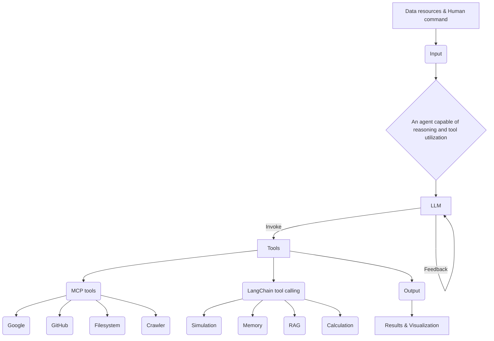

## 🎯 Relevance
This work is highly relevant for industrial applications by automating complex process engineering tasks like simulation, optimization, and carbon accounting, which traditionally require significant manual effort and specialized expertise. It offers substantial ROI through energy savings (80% reduction in distillation energy demand with heat pumps) and significant GHG emission reductions (up to 98% decarbonization potential). It serves as a valuable learning opportunity for integrating advanced AI (LLMs, agents, RAG) with commercial process simulators (Aspen Plus) to drive sustainability initiatives in the chemical industry.

## 📖 Content
This document, an 'Article in Press' from Communications Engineering, details the development and application of a reasoning agent for automating chemical process simulation, optimization, carbon accounting, and decarbonization strategies, specifically focusing on distillation. The core idea is to leverage large language models (LLMs) combined with an extensive tool set to overcome the laborious manual effort typically required for these tasks.

**1. Introduction and Motivation:**
The chemical sector contributes approximately 4% of global greenhouse gas (GHG) emissions. Decarbonization requires high-resolution models of supply chains, production technologies, and GHG emissions, which is a complex and interdisciplinary task. Distillation, a widely used and energy-intensive separation technology, is highlighted as a key area for improvement. Heat pump-assisted distillation is presented as an energy-saving technology. The manual nature of current process simulation and optimization, requiring expertise in both chemical engineering and carbon accounting, necessitates new automated technologies.

Artificial intelligence (AI), particularly LLMs based on Transformer architecture, offers opportunities due to their natural language processing, rich knowledge base, and reasoning capabilities (e.g., chain-of-thought prompting). LLMs can be connected to external tools (memory, search engines, professional software) to form agents capable of autonomous reasoning and task execution. This study focuses on tailoring LLM-based agents for process design and GHG accounting.

**2. Agent Architecture and Workflow (Figure 1):**
The developed agent is capable of reasoning and utilizing an extensive suite of tools. It is built around a central LLM, Grok 3, which interprets natural language prompts, invokes necessary tools, and iteratively refines its actions based on tool feedback. The agent is implemented with LangChain, mediating interactions between Grok 3 and external software modules. Two classes of auxiliary tools are exposed:
*   **LangChain-based tool calling:** For general utilities.
*   **Model Context Protocol (MCP) tools:** For specific operations like web searching (Google), repository inspection (GitHub), file system access, web crawling, simulation (Aspen Plus), memory management, Retrieval-Augmented Generation (RAG), and calculation.

**Figure 1a: Agent Framework**

**Figure 1b: AI-driven Workflow**
The workflow is decomposed into four main stages:
*   **Material collection and learning:**
    *   Agent searches for and downloads Aspen Plus backup (.bkp) files from the Internet and converts them into human-readable input (.inp) files.
    *   LLM learns from selected .inp files and official input language guides.
*   **Process simulation:**
    *   LLM generates an instruction-compliant .inp file for a shortcut distillation (DSTWU) model.
    *   Python calls Aspen Plus to run the .inp file, exporting a .rep file with minimum reflux ratio and stage number.
    *   LLM generates an .inp file for a rigorous distillation (RadFrac) model based on design specifications from the .rep file.
*   **Process optimization:**
    *   Aspen Plus runs sensitivity analyses and exports .rep files.
    *   LLM analyzes sensitivity analyses and simulates the optimal condition before exporting the .rep file.
*   **Carbon accounting and visualization:**
    *   LLM calculates electricity and steam demand based on the .rep file.
    *   Carbon emission calculation based on demand and retrieved emission factors (using RAG).
    *   LLM autonomously generates graphs to present the results.

**3. Case Study: Methanol and Ethanol Distillation:**
The agent was applied to a case study involving the separation of a 100 kg h⁻¹ feed mixture (40 wt% methanol, 60 wt% ethanol) into top and bottom streams with 98 wt% purity for methanol and ethanol, respectively.

**3.1. Simulation and Optimization of Traditional Distillation:**
*   The agent used the DSTWU model (Winn-Underwood-Gilliland method) to estimate the minimum reflux ratio ($R_{min}$) and total theoretical plates ($N_t$). The NRTL method was used for activity coefficient calculation. Initial estimates were $R_{min} = 3.08$ and $N_t = 16$. Top and bottom flows were 39.6 kg h⁻¹ and 60.4 kg h⁻¹, respectively.
*   These results, along with an official guide and examples, were used by the agent to generate an .inp file for the rigorous RadFrac model.
*   Optimization involved minimizing heat duty, operation energy cost, and GHG emissions by varying $N_t$, feed stream location ($F_s$), and reflux ratio. A sensitivity analysis showed that increasing $N_t$ from 21 to 40 reduced the reboiler heat duty from 98.6 kW to 50.3 kW, with the best $F_s$ shifting from 12 to 23. The optimal design selected had 34 theoretical stages and a feed stream located above stage 20, resulting in a minimized reboiler duty of 53.7 kW and a reflux ratio of 3.04 (Figure 2).

**Figure 2a: Traditional Distillation Column**
(Diagram shows a distillation column with feed F (100 kg/h, 40wt% methanol, 60wt% ethanol), top product D (39.6 kg/h, 98wt% methanol, 2wt% ethanol) with condenser duty 48.6 kW at 64.7 °C, and bottom product W (60.4 kg/h, 2wt% methanol, 98wt% ethanol) with reboiler duty 53.7 kW at 80.3 °C.)

**Figure 2b & 2c:** Plots showing the impact of theoretical stage number ($N_t$) and feed stage on reflux ratio and reboiler heat duty, demonstrating optimization curves.

**3.2. GHG Emission Calculation and Visualization:**
*   The agent established three energy supply scenarios: coal-based, natural gas-based, and renewables (biomass for steam, wind power for electricity).
*   Steam and electricity demands were extracted from simulation results. Emission factors were retrieved from a RAG database (e.g., IPCC Guidelines).
*   **GHG Emission Equation:**
    $$GHG_t = (Consump_{steam} \times EF_{steam} + Consump_{electricity} \times EF_{electricity}) \times 3600 \quad (5)$$
    where $Consump$ are consumptions in kJ s⁻¹, and $EF$ are emission factors in kgCO₂e kJ⁻¹.
*   **Cooling Water Flowrate:**
    $$Flowrate = HeatDuty_{cooling} / HeatCap / TR \quad (6)$$
*   **Energy Input to Cooling Water:**
    $$\frac{W_e}{g} + Z_1 + \frac{u_1^2}{2g} + \frac{p_1}{\rho g} = Z_2 + \frac{u_2^2}{2g} + \frac{p_2}{\rho g} + \sum h_f \quad (7)$$
*   **Pump Electricity Consumption:**
    $$Consump_{pumpelectricity} = \frac{W_e \times Flowrate}{\eta} \quad (8)$$
    where $W_e$ is energy input to cooling water, $Z$ heights, $u$ velocities, $p$ pressures, $\sum h_f$ total flow resistance, $\eta$ pump efficiency.
*   **Results for Traditional Distillation:** Coal-based scenario had the highest GHG emissions (20.3 kg CO₂e h⁻¹). Natural gas reduced emissions by 44%, and renewables by 93% (Figure 3).

**3.3. Heat Pump-Assisted Distillation for Energy Saving and Decarbonization:**
*   The agent designed a heat pump-assisted distillation process (Figure 4) to utilize condensation heat by compressing vapor from the column top and transferring it to the reboiler.
*   This process required 10.7 kW electricity for the compressor, saving 53.7 kW steam input. This resulted in an 80% reduction in energy demand compared to the optimized traditional process.
*   **GHG Emissions with Heat Pump:** When combined with renewables, the heat pump-assisted process reduced carbon emissions by 98% compared to the coal-based traditional process. Even with coal as the energy source, the heat pump reduced emissions by 56%.

**Figure 3: Carbon Emissions Comparison**
(Bar chart comparing carbon emissions (kg CO₂ h⁻¹) for traditional and heat pump-assisted distillation under coal, natural gas, and renewables scenarios. Shows significant reduction with heat pump and renewables.)

**Figure 4: Heat Pump-Assisted Distillation Process**
(Process flow diagram showing the distillation column, compressor, heat exchanger 1 (reboiler heat integration), heat exchanger 2 (cooling), and stream splitter. Key parameters like flow rates, temperatures, pressures, and heat duties are indicated.)

**4. Discussion and Advantages of the Agent:**
*   **Automation:** The agent automates laborious process simulation, optimization, and carbon emission accounting.
*   **Transparency:** The process enables interpretability and verification, fostering trust among practitioners.
*   **Scalability:** The inherently parallel nature of the agent facilitates large-scale deployment, and the workflow can be transferred to other chemical processes.
*   **High Reasoning Capability:** Grok 3 demonstrated strong reasoning for generating .inp files and conducting multi-stage carbon emission accounting.
*   **Integration:** Successfully integrated reasoning with the Reasoning-Acting framework and external tools like Aspen Plus and RAG.
*   **Sustainability Impact:** Facilitates high-resolution carbon emission models and systematic quantification of decarbonization strategies, leading to simultaneous energy, GHG emission, and cost reduction.

**5. Methods Details:**
*   **LLM-driven material collection:** An MCP-based workflow linked the LLM to web searching, repository inspection, and file transfer utilities. The agent downloaded and processed 131 Aspen Plus .bkp files, converting 125 valid ones to .inp format. Prompt engineering was crucial for guiding the agent and reducing false positives.
*   **RAG System:** For emission factors, a RAG system was built. It indexed over 100 documents (literature, reports), chunked them, converted chunks to vector embeddings (using bge-base-en-v1.5 model), and stored them in a Qdrant vector database. When queried, it retrieved relevant chunks and passed them as context to Grok 3, prioritizing official sources like IPCC Guidelines, to generate accurate, contextually relevant responses.

This study demonstrates a significant step towards autonomous process engineering for sustainability, combining advanced AI with traditional simulation tools.

## 💡 Key Insights
- Developed a reasoning agent leveraging LLMs (Grok 3) and an extensive tool set (Aspen Plus, RAG, LangChain) to automate chemical process simulation, optimization, and carbon accounting.
- Demonstrated the agent's capability through a methanol-ethanol distillation case study, including traditional and heat pump-assisted designs.
- Achieved a 98% reduction in carbon emissions for distillation by combining heat pump-assisted technology with renewable energy sources compared to a coal-based traditional process.
- The agent provides transparency, interpretability, and scalability for complex process engineering and sustainability assessments, addressing the laborious nature of manual methods.
- Integrated a Retrieval-Augmented Generation (RAG) system to accurately retrieve and apply carbon emission factors from diverse literature and official sources.

## 📚 References
- Tan, S., Zhou, X., Zhou, H. et al. Reasoning-agent-driven process simulation, optimization, carbon accounting and decarbonization of distillation. Commun Eng (2026). https://doi.org/10.1038/s44172-025-00583-3 *(source)*
- Cullen, L., Meng, F., Lupton, R. & M. Reducing uncertainties in greenhouse gas emissions from chemical production. Nature Chemical Engineering 1, 311–322 (2024). *(cited)*
- Kiss, A. A. & Smith, R. Rethinking energy use in distillation processes for a more sustainable chemical industry. Energy 203, 117788 (2020). *(cited)*
- Yao, S. et al. ReAct: Synergizing Reasoning and Acting in Language Models. In International Conference on Learning Representations (2023). *(cited)*
- Lewis, P. et al. Retrieval-Augmented Generation for Knowledge-Intensive NLP Tasks. in Advances in Neural Information Processing Systems (eds. Larochelle, H., Ranzato, M., Hadsell, R., Balcan, M. F. & Lin, H.) vol. 33 9459–9474 (Curran Associates, Inc., 2020). *(cited)*

## 🏷️ Classification
The content primarily focuses on the application of AI agents to automate and optimize core process engineering tasks such as process simulation, design (conception), and optimization of distillation columns, with a strong emphasis on decarbonization strategies. This directly aligns with the 'Conception, simulation, contrôle, scale-up' aspects of the Process_Engineering category.
