## 🎯 Relevance
This tool provides a user-friendly, web-based environment for dynamic system simulation, which is critical for process engineers in designing, analyzing, and optimizing industrial processes. Its 'no server required' approach and real-time visualization capabilities offer a significant learning opportunity and can accelerate prototyping and collaboration in process development and control system design.

## 📖 Content
[](https://raw.githubusercontent.com/pathsim/pathview/main/static/pathview_logo.png)

* * *

PathView - System Modeling in the Browser
-----------------------------------------

A web-based visual node editor for building and simulating dynamic systems with [PathSim](https://github.com/pathsim/pathsim) as the backend. Runs entirely in the browser via Pyodide - no server required. The UI is hosted at [view.pathsim.org](https://view.pathsim.org/), free to use for everyone.

Tech Stack
----------

*   [SvelteKit 5](https://kit.svelte.dev/) with Svelte 5 runes
*   [SvelteFlow](https://svelteflow.dev/) for the node editor
*   [Pyodide](https://pyodide.org/) for in-browser Python/NumPy/SciPy
*   [Plotly.js](https://plotly.com/javascript/) for interactive plots
*   [CodeMirror 6](https://codemirror.net/) for code editing

Getting Started
---------------

```bash
npm install
npm run dev
```

For production:

```bash
npm run build
npm run preview
```

Project Structure
-----------------

```
src/
├── lib/
│   ├── actions/           # Svelte actions (paramInput)
│   ├── animation/         # Graph loading animations
│   ├── components/        # UI components
│   │   ├── canvas/        # Flow editor utilities (connection, transforms)
│   │   ├── dialogs/       # Modal dialogs
│   │   │   └── shared/    # Shared dialog components (ColorPicker, etc.)
│   │   ├── edges/         # SvelteFlow edge components (ArrowEdge)
│   │   ├── icons/         # Icon component (Icon.svelte)
│   │   ├── nodes/         # Node components (BaseNode, EventNode, AnnotationNode, PlotPreview)
│   │   └── panels/        # Side panels (Simulation, NodeLibrary, CodeEditor, Plot, Console, Events)
│   ├── constants/         # Centralized constants (nodeTypes, layout, handles)
│   ├── events/            # Event system
│   │   └── generated/     # Auto-generated from PathSim
│   ├── export/            # Export utilities
│   │   └── svg/           # SVG graph export (renderer, types)
│   ├── nodes/             # Node type system
│   │   ├── generated/     # Auto-generated from PathSim
│   │   └── shapes/        # Node shape definitions
│   ├── plotting/          # Plot system
│   │   ├── core/          # Constants, types, utilities
│   │   ├── processing/    # Data processing, render queue
│   │   └── renderers/     # Plotly and SVG renderers
│   ├── routing/           # Orthogonal wire routing (A* pathfinding)
│   ├── pyodide/           # Python runtime (backend, bridge)
│   │   └── backend/       # Modular backend system (registry, state, types)
│   │       └── pyodide/   # Pyodide Web Worker implementation
│   ├── schema/            # File I/O (save/load, component export)
│   ├── simulation/        # Simulation metadata
│   │   └── generated/     # Auto-generated defaults
│   ├── stores/            # Svelte stores (state management)
│   │   └── graph/         # Graph state with subsystem navigation
│   ├── types/             # TypeScript type definitions
│   └── utils/             # Utilities (colors, download, csvExport, codemirror)
├── routes/                # SvelteKit pages
└── app.css                # Global styles with CSS variables

scripts/
├── config/                # Configuration files for extraction
│   ├── schemas/           # JSON schemas for validation
│   ├── pathsim/           # Core PathSim blocks, events, simulation config
│   ├── pathsim-chem/      # Chemical toolbox blocks
│   ├── pyodide.json       # Pyodide version and preload packages
│   ├── requirements-pyodide.txt   # Runtime Python packages
│   └── requirements-build.txt     # Build-time Python packages
├── generated/             # Generated files (from extract.py)
│   └── registry.json      # Block/event registry with import paths
├── extract.py             # Unified extraction script
└── pvm2py.py              # Standalone .pvm to Python converter
```

* * *

Architecture Overview
---------------------

### Data Flow

```mermaid
graph TD
    A[Graph Store\n(nodes, edges)] --> B[pathsimRunner\n(code gen)]
    B --> C[Python Code\n(string)]
    C --> D[REPL Worker\n(Pyodide)]
    D --> E[bridge.ts\n(queue + rAF)]
    E --> F[Plot/Console\n(results)]
```

### Streaming Architecture

Simulations run in streaming mode for real-time visualization. The worker runs autonomously and pushes results without waiting for the UI:

```mermaid
graph LR
    Worker["Worker (10 Hz)\n┌──────────────┐\n│ Python loop  │\n│ (autonomous) │\n│              │\n└──────────────┘"] -- "stream-data" --> MainThread["Main Thread\n┌──────────────┐\n│ Result Queue │\n│ (accumulate) │\n│              │\n└──────────────┘"]
    MainThread -- "rAF\nbatched" --> UI["UI (10 Hz)\n┌──────────────┐\n│ Plotly       │\n│ extendTraces │\n│              │\n└──────────────┘"]
```



*   **Decoupled rates**: Python generates data at 10 Hz, UI renders at 10 Hz max
*   **Queue-based**: Results accumulate in queue, merged on each UI frame
*   **Non-blocking**: Simulation never waits for plot rendering
*   **extendTraces**: Scope plots append data incrementally instead of full re-render

### Wire Routing

PathView uses Simulink-style orthogonal wire routing with A* pathfinding:

*   **Automatic routing**: Wires route around nodes with 90° bends only
*   **User waypoints**: Press `\` on selected edge to add manual waypoints
*   **Draggable waypoints**: Drag waypoint markers to reposition, double-click to delete
*   **Segment dragging**: Drag segment midpoints to create new waypoints
*   **Incremental updates**: Spatial indexing (O(1) node updates) for smooth dragging
*   **Hybrid routing**: Routes through user waypoints: Source → A* → W1 → A* → Target

Key files: `src/lib/routing/` (pathfinder, grid builder, route calculator)

### Key Abstractions

| Layer | Purpose | Key Files |
| --- | --- | --- |
| **Main App** | Orchestrates panels, shortcuts, file ops | `routes/+page.svelte` |
| **Flow Canvas** | SvelteFlow wrapper, node/edge sync | `components/FlowCanvas.svelte` |
| **Flow Updater** | View control, animation triggers | `components/FlowUpdater.svelte` |
| **Context Menus** | Right-click menus for nodes/canvas/plots | `components/ContextMenu.svelte`, `contextMenuBuilders.ts` |
| **Graph Store** | Node/edge state, subsystem navigation | `stores/graph/` |
| **View Actions** | Fit view, zoom, pan controls | `stores/viewActions.ts`, `stores/viewTriggers.ts` |
| **Clipboard** | Copy/paste/duplicate operations | `stores/clipboard.ts` |
| **Plot Settings** | Per-trace and per-block plot options | `stores/plotSettings.ts` |
| **Node Registry** | Block type definitions, parameters | `nodes/registry.ts` |
| **Code Generation** | Graph → Python code | `pyodide/pathsimRunner.ts` |
| **Backend** | Modular Python execution interface | `pyodide/backend/` |
| **Backend Registry** | Factory for swappable backends | `pyodide/backend/registry.ts` |
| **PyodideBackend** | Web Worker Pyodide implementation | `pyodide/backend/pyodide/` |
| **Simulation Bridge** | High-level simulation API | `pyodide/bridge.ts` |
| **Schema** | File/component save/load operations | `schema/fileOps.ts`, `schema/componentOps.ts` |
| **Export Utils** | SVG/CSV/Python file downloads | `utils/download.ts`, `export/svg/`, `utils/csvExport.ts` |

### Centralized Constants

Use these imports instead of magic strings:

```typescript
import { NODE_TYPES } from '$lib/constants/nodeTypes';
// NODE_TYPES.SUBSYSTEM, NODE_TYPES.INTERFACE

import { PORT_COLORS, DIALOG_COLOR_PALETTE } from '$lib/utils/colors';
// PORT_COLORS.default, etc.
```

* * *

Adding New Blocks
-----------------

Blocks are extracted automatically from PathSim using the `Block.info()` classmethod. The extraction is config-driven for easy maintenance.

### 1. Ensure the block exists in PathSim

The block must be importable from `pathsim.blocks` (or toolbox module):

```python
from pathsim.blocks import YourNewBlock
```

### 2. Add to block configuration

Edit `scripts/config/pathsim/blocks.json` and add the block class name to the appropriate category:

```json
{
  "categories": {
    "Algebraic": [
      "Adder",
      "Multiplier",
      "YourNewBlock"
    ]
  }
}
```

Port configurations are automatically extracted from `Block.info()`:

*   `None` → Variable/unlimited ports (UI allows add/remove)
*   `{}` → No ports of this type
*   `{"name": index}` → Fixed labeled ports (locked count)

### 3. Run extraction

```bash
npm run extract
```

This generates TypeScript files in `src/lib/*/generated/` with:

*   Block metadata (parameters, descriptions, docstrings)
*   Port configurations from `Block.info()`
*   Pyodide runtime config

### 4. Verify

Start the dev server and check that your block appears in the Block Library panel.

### Port Synchronization

Some blocks process inputs as parallel paths where each input has a corresponding output (e.g., Integrator, Amplifier, Sin). For these blocks, the UI only shows input port controls and outputs auto-sync.

Configure in `src/lib/nodes/uiConfig.ts`:

```typescript
export const syncPortBlocks = new Set([
  'Integrator',
  'Differentiator',
  'Delay',
  'PID',
  'PID_Antiwindup',
  'Amplifier',
  'Sin', 'Cos', 'Tan', 'Tanh',
  'Abs', 'Sqrt', 'Exp', 'Log', 'Log10',
  'Mod', 'Clip', 'Pow',
  'SampleHold'
]);
```

### Port Labels from Parameters

Some blocks derive port names from a parameter (e.g., Scope and Spectrum use `labels` to name input traces). When the parameter changes, port names update automatically.

Configure in `src/lib/nodes/uiConfig.ts`:

```typescript
export const portLabelParams: Record<string, PortLabelConfig | PortLabelConfig[]> = {
  Scope: { param: 'labels', direction: 'input' },
  Spectrum: { param: 'labels', direction: 'input' },
  // Multiple directions supported:
  // SomeBlock: [
  // { param: 'input_labels', direction: 'input' },
  // { param: 'output_labels', direction: 'output' }
  // ]
};
```

* * *

Adding New Toolboxes
--------------------

To add a new PathSim toolbox (like `pathsim-chem`):

### 1. Add to requirements

Edit `scripts/config/requirements-pyodide.txt`:

```
--pre
pathsim
pathsim-chem>=0.2rc2  # optional
pathsim-controls      # optional - your new toolbox
```

The `# optional` comment means Pyodide will continue loading if this package fails to install.

### 2. Create toolbox config

Create `scripts/config/pathsim-controls/blocks.json`:

```json
{
  "$schema": "../schemas/blocks.schema.json",
  "toolbox": "pathsim-controls",
  "importPath": "pathsim_controls.blocks",

  "categories": {
    "Controls": [
      "PIDController",
      "StateEstimator"
    ]
  }
}
```

### 3. (Optional) Add events

Create `scripts/config/pathsim-controls/events.json` if the toolbox has custom events.

### 4. Run extraction and build

```bash
npm run extract
npm run build
```

No code changes needed - the extraction script automatically discovers toolbox directories.

* * *

Python Backend System
---------------------

The Python runtime uses a modular backend architecture, allowing different execution environments (Pyodide, local Python, remote server) to be swapped without changing application code.

### Architecture

```mermaid
graph TD
    subgraph Backend Interface
        A[init(), exec(), evaluate(), startStreaming(), stopStreaming()...]
    end
    A --> B(Pyodide Backend\n(Worker))
    A --> C(Local Backend\n(Flask)):::future
    A --> D(Remote Backend\n(Server)):::future
    B --> E(Web Worker\n(Pyodide))

    classDef future fill:#ccc,stroke:#999,stroke-width:1px,color:#333;
```

### Backend Registry

```typescript
import { getBackend, switchBackend } from '$lib/pyodide/backend';

// Get current backend (defaults to Pyodide)
const backend = getBackend();

// Switch to a different backend type (future)
// switchBackend('local'); // Use local Python via Flask
// switchBackend('remote'); // Use remote server
```

### REPL Protocol
**Requests** (Main → Worker):

```typescript
type REPLRequest =
  | { type: 'init' }
  | { type: 'exec'; id: string; code: string }      // Execute code (no return)
  | { type: 'eval'; id: string; expr: string }      // Evaluate expression (returns JSON)
  | { type: 'stream-start'; id: string; expr: string }  // Start streaming loop
  | { type: 'stream-stop' }                         // Stop streaming loop
  | { type: 'stream-exec'; code: string }           // Execute code during streaming
```

**Responses** (Worker → Main):

```typescript
type REPLResponse =
  | { type: 'ready' }
  | { type: 'ok'; id: string }                   // exec succeeded
  | { type: 'value'; id: string; value: string } // eval result (JSON)
  | { type: 'error'; id: string; error: string; traceback?: string }
  | { type: 'stdout'; value: string }
  | { type: 'stderr'; value: string }
  | { type: 'progress'; value: string }
  | { type: 'stream-data'; id: string; value: string }  // Streaming result
  | { type: 'stream-done'; id: string }                 // Streaming completed
```

### Usage Example

```typescript
import { init, exec, evaluate } from '$lib/pyodide/backend';

// Initialize backend (Pyodide by default)
await init();

// Execute Python code
await exec(`
import numpy as np
x = np.linspace(0, 10, 100)
`);

// Evaluate and get result
const result = await evaluate<number[]>('x.tolist()');
```

### High-Level API (bridge.ts)
For simulation, use the higher-level API in `bridge.ts`:

```typescript
import {
  runStreamingSimulation,
  continueStreamingSimulation,
  stopSimulation,
  execDuringStreaming
} from '$lib/pyodide/bridge';

// Run streaming simulation
const result = await runStreamingSimulation(pythonCode, duration, (partialResult) => {
  console.log('Progress:', partialResult.scopeData);
});
// result.scopeData, result.spectrumData, result.nodeNames

// Continue simulation from where it stopped
const moreResult = await continueStreamingSimulation('5.0');

// Stop simulation gracefully
await stopSimulation();

// Execute code during active simulation (queued between steps)
execDuringStreaming('source.amplitude = 2.0');
```

* * *

State Management
----------------

### SvelteFlow vs Graph Store

SvelteFlow manages its own UI state (selection, viewport, node positions). The graph store manages application data:

| State Type | Managed By | Examples |
| --- | --- | --- |
| **UI State** | SvelteFlow | Selection, viewport, dragging |
| **App Data** | Graph Store | Node parameters, connections, subsystems |

Do not duplicate SvelteFlow state in custom stores. Use SvelteFlow's APIs (`useSvelteFlow`, event handlers) to interact with canvas state.

### Store Pattern

Stores use Svelte's writable with custom wrapper objects:

```typescript
const internal = writable<T>(initialValue);

export const myStore = {
    subscribe: internal.subscribe,

    // Custom methods
    doSomething() {
        internal.update(state => ({ ...state, ... }));
    }
};
```

**Important**: Do NOT wrap `.subscribe()` in `$effect()` - this causes infinite loops.

```svelte
<script>
// Correct
myStore.subscribe(value => { localState = value; });

// Wrong - causes infinite loop
$effect(() => {
 myStore.subscribe(value => { localState = value; });
});
</script>
```

### Subsystem Navigation

Subsystems are nested graphs with path-based navigation:

```typescript
graphStore.drillDown(subsystemId);  // Drill into subsystem
graphStore.drillUp();               // Go up one level
graphStore.navigateTo(level);       // Navigate to breadcrumb level
graphStore.currentPath              // Current navigation path
```

The Interface node inside a subsystem mirrors its parent Subsystem's ports (with inverted direction).

* * *

Keyboard Shortcuts
------------------

Press `?` to see all shortcuts in the app. Key shortcuts:

| Category | Shortcut | Action |
| --- | --- | --- |
| **File** | `Ctrl+O` | Open |
|  | `Ctrl+S` | Save |
|  | `Ctrl+E` | Export Python |
| **Edit** | `Ctrl+Z/Y` | Undo/Redo |
|  | `Ctrl+D` | Duplicate |
|  | `Ctrl+F` | Find |
|  | `Del` | Delete |
| **Transform** | `R` | Rotate 90° |
|  | `X` / `Y` | Flip H/V |
|  | `Arrows` | Nudge selection |
| **Wires** | `\` | Add waypoint to selected edge |
| **View** | `F` | Fit view |
|  | `H` | Go to root |
|  | `T` | Toggle theme |
| **Panels** | `B` | Blocks |
|  | `N` | Events |
|  | `S` | Simulation |
|  | `V` | Results |
|  | `C` | Console |
| **Run** | `Ctrl+Enter` | Simulate |
|  | `Shift+Enter` | Continue |

* * *

File Formats
------------

PathView uses JSON-based file formats for saving and sharing:

| Extension | Type | Description |
| --- | --- | --- |
| `.pvm` | Model | Complete simulation model (graph, events, settings, code) |
| `.blk` | Block | Single block with parameters (for sharing/reuse) |
| `.sub` | Subsystem | Subsystem with internal graph (for sharing/reuse) |

### Export Options

*   **File > Save** - Save complete model as `.pvm`
*   **File > Export Python** - Generate standalone Python script
*   **Right-click node > Export** - Save individual block/subsystem
*   **Right-click canvas > Export SVG** - Export graph as vector image
*   **Right-click plot > Download PNG/SVG** - Export plot as image
*   **Right-click plot > Export CSV** - Export simulation data as CSV
*   **Scope/Spectrum node context menu** - Export simulation data as CSV

* * *

Sharing Models via URL
----------------------

Models can be loaded directly from a URL using query parameters:

```
https://view.pathsim.org/?model=<url>
https://view.pathsim.org/?modelgh=<github-shorthand>
```

### Parameters

| Parameter | Description | Example |
| --- | --- | --- |
| `model` | Direct URL to a `.pvm` or `.json` file | `?model=https://example.com/mymodel.pvm` |
| `modelgh` | GitHub shorthand (expands to raw.githubusercontent.com) | `?modelgh=user/repo/path/to/model.pvm` |

### GitHub Shorthand

The `modelgh` parameter expands to a raw GitHub URL:

```
modelgh=user/repo/examples/demo.pvm
→ https://raw.githubusercontent.com/user/repo/main/examples/demo.pvm
```

### Examples

```
# Load from any URL
https://view.pathsim.org/?model=https://mysite.com/models/feedback.pvm

# Load from GitHub repository
https://view.pathsim.org/?modelgh=pathsim/pathview/static/examples/feedback-system.json
```

* * *

Scripts
-------

| Script | Purpose |
| --- | --- |
| `npm run dev` | Start development server |
| `npm run build` | Production build |
| `npm run preview` | Preview production build |
| `npm run check` | TypeScript/Svelte type checking |
| `npm run lint` | Run ESLint |
| `npm run format` | Format code with Prettier |
| `npm run extract` | Regenerate all definitions from PathSim |
| `npm run extract:blocks` | Blocks only |
| `npm run extract:events` | Events only |
| `npm run extract:simulation` | Simulation params only |
| `npm run extract:deps` | Dependencies only |
| `npm run extract:validate` | Validate config files |
| `npm run pvm2py -- <file>` | Convert `.pvm` file to standalone Python script |

* * *

Node Styling
------------

Nodes are styled based on their category, with CSS-driven shapes and colors.

### Shapes by Category

| Category | Shape | Border Radius |
| --- | --- | --- |
| Sources | Pill | 20px |
| Dynamic | Rectangle | 4px |
| Algebraic | Rectangle | 4px |
| Mixed | Asymmetric | 12px 4px 12px 4px |
| Recording | Pill | 20px |
| Subsystem | Rectangle | 4px |

Shapes are defined in `src/lib/nodes/shapes/registry.ts` and applied via CSS classes (`.shape-pill`, `.shape-rect`, etc.).

### Colors

*   **Default node color**: CSS variable `--accent` (#0070C0 - PathSim blue)
*   **Custom colors**: Right-click node → Properties → Color picker (12 colors available)
*   **Port colors**: `PORT_COLORS.default` (#969696 gray), customizable per-port

Colors are CSS-driven - see `src/app.css` for variables and `src/lib/utils/colors.ts` for palettes.

### Adding Custom Shapes

1.   Register the shape in `src/lib/nodes/shapes/registry.ts`:

```typescript
registerShape({
  id: 'hexagon',
  name: 'Hexagon',
  cssClass: 'shape-hexagon',
  borderRadius: '0px'
}); 
```
2.   Add CSS in `src/app.css` or component styles:

```css
.shape-hexagon {
  clip-path: polygon(25% 0%, 75% 0%, 100% 50%, 75% 100%, 25% 100%, 0% 50%);
}
```
3.   Optionally map categories to the new shape:

```typescript
setCategoryShape('MyCategory', 'hexagon'); 
```

* * *

Design Principles
-----------------

1.  **Python is first-class** - All node parameters are Python expressions stored as strings and passed verbatim to PathSim. PathSim handles all type checking and validation at runtime.

2.  **Subsystems are nested graphs** - The Interface node inside a subsystem mirrors its parent's ports (inverted direction).

3.  **No server required** - Everything runs client-side via Pyodide WebAssembly.

4.  **Registry pattern** - Nodes and events are registered centrally for extensibility.

5.  **Minimal state** - Derive where possible, avoid duplicating truth. SvelteFlow manages its own UI state.

6.  **CSS for styling** - Use CSS variables from `app.css` and component `<style>` blocks, not JavaScript theme APIs.

7.  **Svelte 5 runes** - Use `$state`, `$derived`, `$effect` exclusively.

* * *

Performance Optimizations
-------------------------

### Streaming Simulation

*   **Autonomous worker**: Python runs in a Web Worker loop, pushing results without waiting for UI acknowledgment
*   **Queue-based updates**: Results accumulate in a queue, merged in batches via `requestAnimationFrame`
*   **Decoupled rates**: Simulation @ 10 Hz, UI updates @ 10 Hz max - expensive plots don't slow simulation

### Plotly Rendering

*   **extendTraces**: During streaming, scope plots append new data instead of full re-render
*   **SVG mode**: Uses `scatter` (SVG) instead of `scattergl` (WebGL) for stability during streaming
*   **Visibility API**: Pauses plot updates when browser tab is hidden

### Node Previews

*   **Separate render queue**: Plot previews in nodes use SVG paths (not Plotly)
*   **Min-max decimation**: Large datasets downsampled while preserving peaks/valleys
*   **Deferred rendering**: Shared queue prevents preview updates from blocking main plots

* * *

Deployment
----------

PathView uses a dual deployment strategy with automatic versioning:

| Trigger | What happens | Deployed to |
| --- | --- | --- |
| Push to `main` | Build with base path `/dev` | [view.pathsim.org/dev/](https://view.pathsim.org/dev/) |
| Release published | Bump `package.json`, build, deploy | [view.pathsim.org/](https://view.pathsim.org/) |
| Manual dispatch | Choose `dev` or `release` | Respective path |

### How it works

1.  Both versions deploy to the `deployment` branch using GitHub Actions
2.  Dev builds update only the `/dev` folder, preserving the release at root
3.  Release builds update root, preserving `/dev`
4.  Version in `package.json` is automatically bumped from the release tag (e.g., `v0.4.0` → `0.4.0`)

### Creating a release

1.  Create a GitHub release with a version tag (e.g., `v0.4.0`)
2.  The workflow automatically: 
    *   Updates `package.json` to match the tag
    *   Commits the version bump to `main`
    *   Builds and deploys to production

* * *

License
-------
MIT

## 💡 Key Insights
- PathView is a web-based visual node editor for building and simulating dynamic systems using PathSim as the Python backend.
- It runs entirely client-side in the browser via Pyodide (Python in WebAssembly), eliminating the need for a server.
- Features a streaming architecture for real-time visualization of simulation results with decoupled simulation and UI update rates.
- Supports Simulink-style orthogonal wire routing with A* pathfinding and user-defined waypoints.
- Offers a modular Python backend architecture, allowing for future integration with local or remote Python execution environments.
- Provides extensibility for adding new PathSim blocks and toolboxes through a configuration-driven extraction process.
- Utilizes JSON-based file formats (.pvm, .blk, .sub) for models and components, and supports URL-based model sharing.
- Includes performance optimizations such as incremental Plotly rendering and min-max decimation for node previews.

## 📚 References
- pathsim/pathview GitHub Repository, https://github.com/pathsim/pathview *(source)*
- pathsim/pathsim GitHub Repository, https://github.com/pathsim/pathsim *(cited)*
- SvelteKit 5, https://kit.svelte.dev/ *(cited)*
- SvelteFlow, https://svelteflow.dev/ *(cited)*
- Pyodide, https://pyodide.org/ *(cited)*
- Plotly.js, https://plotly.com/javascript/ *(cited)*
- CodeMirror 6, https://codemirror.net/ *(cited)*

## 🏷️ Classification
PathView is a tool specifically designed for building and simulating dynamic systems, which is a core activity in Process Engineering for conception, analysis, and control system design.
