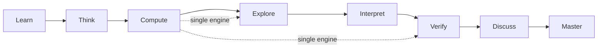

> ⚠️ **Inbox Note**: confidence 0.45 < 0.6

## 🎯 Relevance
Useful as a reference design for transparent, traceable engineering computation (assumptions, units, step-by-step trace) and for grounding an AI tutor in a validated engine. It is relevant for process-engineering training, onboarding, and for building explainable calculation tools or digital-twin interfaces. It is also a landscape item for the educational tools market.

## 📖 Content
## Overview

ChETL (Chemical Engineering Teaching & Learning) is a modular educational web platform (app.chetl.org) for chemical engineering. Its stated aim is to show the *reasoning* behind a result, not just the number. Thermodynamics is the first module, and the platform is designed to extend across the curriculum.

## Problem addressed

Engineering courses often move through three jumps: **Theory → Formula → Answer**. The reasoning in between is skipped. Calculators return a number with no trace, so students must accept results they cannot reconstruct. ChETL inserts an explicit **Reasoning** stage:

```
Theory -> Formula -> Reasoning -> Answer
```

## Result anatomy (example shown on the page)

Each result is presented as four linked layers:

| Layer | Example content |
|---|---|
| RESULT | $Z = 0.87$ |
| THEORY | $Z = \frac{PV}{nRT}$ (the governing relation) |
| COMPUTATION | Solve Redlich-Kwong, take the vapour root for $Z$, every step with units |
| ASSUMPTIONS | Real gas, T = 350 K, P = 80 bar (what must hold) |

The compressibility factor example uses a cubic equation of state (Redlich-Kwong). The vapour-phase root of the cubic gives $Z$, which is compared with the ideal-gas line ($Z=1$).

## Eight-stage workflow around a single calculation

1. **Learn**: narrative chapter on the concept.
2. **Think**: engineering reasoning mapped before any number.
3. **Compute**: the problem is set and one validated engine solves it.
4. **Explore**: the property is plotted against the ideal-gas line.
5. **Interpret**: the result is read back into engineering meaning.
6. **Verify**: every value is traced as formula → substitution → result.
7. **Discuss**: a context-aware AI tutor answers questions about the result.
8. **Master**: assessment that checks reasoning, not only the final number.



## Platform components (tabs around one result)

- **Guided Theory**: narrative chapters written to a strict content standard.
- **Interactive Computation**: changing an input makes the engine recompute every dependent value.
- **The Blackboard**: the engine's numerical trace (formula, substitution, result, units).
- **Interpretation**: physical meaning, engineering consequence, and when to trust the result.
- **AI Tutor**: assistant grounded in the platform's own theory and computation, explaining *this* result.
- **Assessment**: practice with the same step transparency.

## Design principles

- **Single source of truth**: one computational engine produces every value, so text, plots and interpretation always agree.
- **Transparent computation**: every number traces to a formula and substitution with units.
- **Validated models**: established engineering models, applied consistently and checked against reference behaviour.
- **Reasoning by design**: understanding is the deliverable.
- Philosophy: *"An engineer who can reconstruct a result understands it."*

## Curriculum roadmap

| Status | Content |
|---|---|
| Available | Chemical Engineering Thermodynamics: Pure Component Properties, Solution Thermodynamics |
| In development | Phase Equilibrium |
| Planned | Chemical Equilibrium, Thermodynamic Cycles |
| Future placeholders (not in development) | Process Calculations, Reaction Engineering, Heat Transfer, Mass Transfer, Fluid Mechanics, Process Design & Economics, Process Control |

Target audiences are students, educators and departments.

## 💡 Key Insights
- ChETL targets the gap between formula and answer by making the intermediate reasoning explicit and traceable.
- A single validated computation engine feeds theory, plots, blackboard trace, interpretation, AI tutor and assessment, which keeps all views consistent.
- The 'Blackboard' pattern (formula → substitution → result, with units and stated assumptions) is a transferable design for transparent engineering calculators.
- The AI tutor is grounded in the platform's own computation and theory, so it explains the specific result rather than giving generic answers.
- Roadmap: Thermodynamics (pure properties, solution thermodynamics) is available, phase equilibrium is in development, and the other courses are only placeholders.

## 📚 References
- ChETL: Chemical Engineering Teaching & Learning Platform, https://chetl.org/ *(source)*

## 🏷️ Classification
The page presents an educational platform for chemical engineering thermodynamics whose core is a transparent mechanistic computation engine (e.g. equation-of-state solving) with traceable steps.
