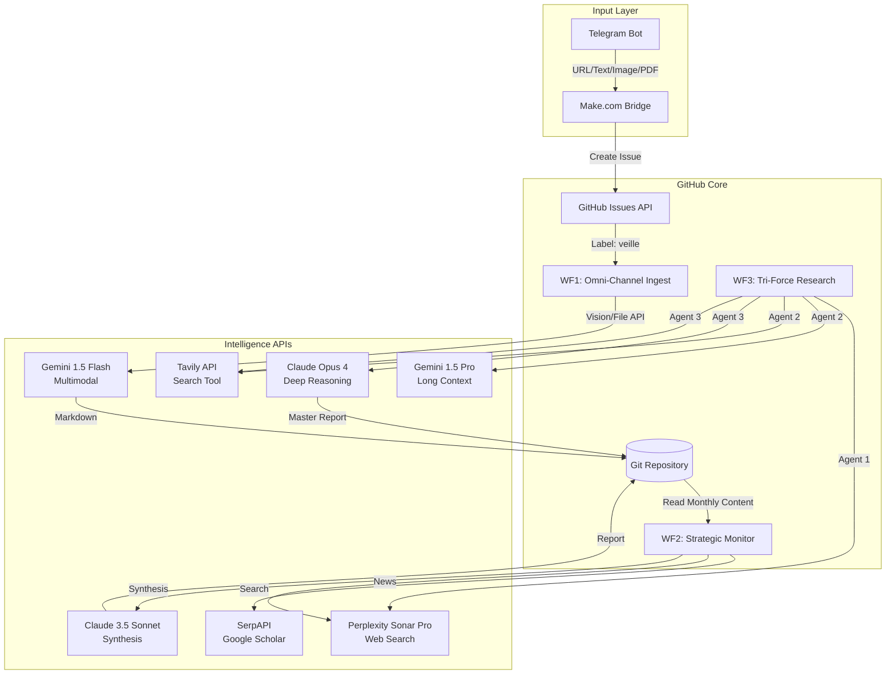
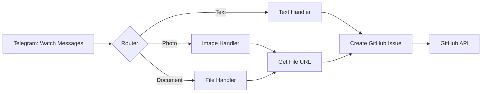

# 📑 Spécifications Techniques : ResearchOps v1.1 (Expert Edition)

**Projet** : ResearchOps  
**Description** : Serverless Multi-Modal Intelligence Pipeline  
**Utilisateur Cible** : Responsable R&D / Ingénieur Docteur / Data Engineer  
**Stack** : GitHub Actions + Python + Multi-LLM + Make.com  
**Budget** : 5-30€/mois selon usage WF3  
**Date** : Janvier 2025

---

## 1. Architecture Système



**Principes** :
- **Zero-Infra** : Pas de serveur, DB, ou storage externe
- **Omnivore** : Accepte tout (Screenshots de paywalls, PDFs, Photos tableaux blancs, URLs)
- **Niveau Expert** : Analyses orientées ROI, Faisabilité Industrielle et Innovation
- **Second Brain** : WF2 synthétise la veille externe ET vos propres captures du mois

---

## 2. Structure Repository

```
/ResearchOps
│
├── .github/
│   ├── workflows/
│   │   ├── wf1_daily_ingest.yml
│   │   ├── wf2_monthly_monitor.yml
│   │   └── wf3_deep_research.yml
│   └── ISSUE_TEMPLATE/
│       └── veille.md
│
├── src/
│   ├── wf1_ingest.py
│   ├── wf2_monitor.py
│   ├── wf3_triforce.py
│   ├── agents/
│   │   ├── perplexity_agent.py
│   │   ├── gemini_agent.py
│   │   └── claude_agent.py
│   ├── synthesizer.py
│   └── utils/
│       ├── multimodal.py      # Gemini Vision/File handlers
│       ├── git_ops.py          # Safe commits (anti-conflict)
│       ├── dedup.py            # Hash-based deduplication
│       ├── quota.py            # API quota tracking
│       └── notify.py           # Telegram notifications
│
├── config/
│   ├── categories.json         # WF1 taxonomy
│   ├── monitoring.json         # WF2 topics
│   ├── prompts.yaml            # Centralized system prompts
│   ├── quota_limits.json       # API thresholds
│   └── make_webhook.json       # Make.com config
│
├── data/
│   ├── history.json            # Dedup hashes (auto-updated)
│   └── quota_tracker.json      # Monthly usage (auto-updated)
│
├── content/                    # WF1 outputs
│   ├── Digital_Twin/
│   ├── N2O_Emissions/
│   ├── ML_Process_Control/
│   └── General/
│
├── reports/                    # WF2 outputs
│   └── 2025/
│
├── research/                   # WF3 outputs
│   └── {YYYYMMDD}_{hash}_{slug}/
│
├── logs/
│   └── {YYYY-MM}.log
│
├── requirements.txt
└── README.md
```

---

## 3. Make.com Bridge (Telegram → GitHub)

### Scenario Make.com



### Configuration Modules

**Module 1 : Telegram Bot (Webhook)**
```json
{
  "module": "telegram:watchMessages",
  "parameters": {
    "botToken": "{{env.TELEGRAM_BOT_TOKEN}}"
  }
}
```

**Module 2 : Router**
```json
{
  "module": "builtin:router",
  "routes": [
    {
      "condition": "{{exists(text)}}",
      "label": "Text Message"
    },
    {
      "condition": "{{exists(photo)}}",
      "label": "Image"
    },
    {
      "condition": "{{exists(document)}}",
      "label": "PDF/File"
    }
  ]
}
```

**Module 3a : Text Handler**
```json
{
  "module": "github:createIssue",
  "parameters": {
    "repo": "Younes/ResearchOps",
    "title": "Ingest: Text - {{substring(text, 0, 50)}}",
    "body": "{{text}}",
    "labels": ["veille"],
    "assignees": []
  }
}
```

**Module 3b : Image Handler**
```json
{
  "module": "telegram:getFile",
  "parameters": {
    "fileId": "{{photo[0].file_id}}"
  },
  "output": "imageUrl"
},
{
  "module": "github:createIssue",
  "parameters": {
    "title": "Ingest: Image - {{formatDate(now, 'YYYY-MM-DD HH:mm')}}",
    "body": "IMAGE_URL: {{imageUrl}}\nCAPTION: {{caption}}",
    "labels": ["veille", "multimodal"]
  }
}
```

**Module 3c : PDF/File Handler**
```json
{
  "module": "telegram:getFile",
  "parameters": {
    "fileId": "{{document.file_id}}"
  },
  "output": "fileUrl"
},
{
  "module": "github:createIssue",
  "parameters": {
    "title": "Ingest: {{document.file_name}}",
    "body": "FILE_URL: {{fileUrl}}\nMIME: {{document.mime_type}}\nSIZE: {{document.file_size}}",
    "labels": ["veille", "multimodal"]
  }
}
```

### Coût Make.com
- **Plan Gratuit** : 1000 opérations/mois
- **Estimation usage** : 30-50 ops/mois
- **Coût** : 0€

---

## 4. Workflow 1 : Omni-Channel Ingest

### Objectif
Transformer **tout input** (URL, texte, image, PDF) en fiche Markdown structurée.

### Trigger
```yaml
on:
  issues:
    types: [opened, labeled]
```
**Condition** : Label `veille` présent

### Pipeline Multi-Modal

```
[GitHub Issue]
    ↓
[Parse Body] → Détecte type (URL / IMAGE_URL / FILE_URL / TEXT)
    ↓
┌─────────────┬──────────────┬──────────────┬──────────────┐
│ URL         │ IMAGE_URL    │ FILE_URL     │ TEXT         │
│ Jina Reader │ Gemini Vision│ Gemini File  │ Direct       │
└──────┬──────┴──────┬───────┴──────┬───────┴──────┬───────┘
       └──────────────┴──────────────┴──────────────┘
                         ↓
              [Gemini Flash Classification]
                         ↓
              [Deduplication Check]
                         ↓
              [Git Commit Markdown]
                         ↓
              [Close Issue + Notify]
```

### Implémentation (`src/wf1_ingest.py`)

```python
import os
import re
import json
import requests
import hashlib
from datetime import datetime
import google.generativeai as genai
from utils.multimodal import process_image, process_pdf
from utils.dedup import is_duplicate, add_to_history
from utils.git_ops import safe_commit
from utils.notify import telegram_notify

genai.configure(api_key=os.getenv("GOOGLE_API_KEY"))

CATEGORIES = json.load(open("config/categories.json"))["categories"]

def parse_issue_body(body):
    """
    Détecte le type d'input dans le body de l'issue
    """
    # Pattern URL standard
    if body.startswith("http://") or body.startswith("https://"):
        return {"type": "url", "content": body.strip()}
    
    # Pattern IMAGE_URL (vient de Make.com)
    match = re.search(r'IMAGE_URL:\s*(https?://\S+)', body)
    if match:
        caption = re.search(r'CAPTION:\s*(.+)', body)
        return {
            "type": "image",
            "url": match.group(1),
            "caption": caption.group(1) if caption else ""
        }
    
    # Pattern FILE_URL (PDF/Doc)
    match = re.search(r'FILE_URL:\s*(https?://\S+)', body)
    if match:
        mime = re.search(r'MIME:\s*(\S+)', body)
        return {
            "type": "file",
            "url": match.group(1),
            "mime": mime.group(1) if mime else "application/octet-stream"
        }
    
    # Texte brut
    return {"type": "text", "content": body}

def fetch_url_content(url):
    """Jina Reader pour URLs web"""
    try:
        response = requests.get(
            f"https://r.jina.ai/{url}",
            headers={"X-Return-Format": "markdown"},
            timeout=20
        )
        response.raise_for_status()
        return response.text
    except Exception as e:
        print(f"[WF1] Jina fetch failed: {e}")
        return None

def classify_with_gemini(content, input_type):
    """
    Gemini Flash pour classification et résumé
    """
    model = genai.GenerativeModel("gemini-1.5-flash")
    
    prompt = f"""You are a strategic intelligence assistant for an R&D Manager and Expert in Process Engineering / Data Science.

INPUT TYPE: {input_type}
CONTENT:
{content[:20000]}

TASK: Analyze and return ONLY valid JSON:
{{
  "category": "choice among {CATEGORIES}",
  "title": "precise technical title",
  "summary": "structured summary (Context, Innovation, Feasibility)",
  "relevance": "Potential impact for industrial R&D or technical roadmap",
  "tags": ["tag1", "tag2", "tag3", "tag4"],
  "type": "Paper|Code|Article|Documentation|Dataset|Tool|Internal_Note"
}}

INSTRUCTIONS:
- Expert Level: No oversimplification, focus on novelty and applicability.
- If it is a partial screenshot/photo, extrapolate the technical context.
- Tags in English.
"""

    response = model.generate_content(
        prompt,
        generation_config={
            "response_mime_type": "application/json",
            "temperature": 0.1
        }
    )
    
    return json.loads(response.text)

def generate_markdown(data, source_url, input_type):
    """Génère le fichier Markdown final"""
    
    date_str = datetime.now().strftime("%Y-%m-%d")
    hash_id = hashlib.md5(source_url.encode()).hexdigest()[:8]
    
    md = f"""---
title: "{data['title']}"
date: {date_str}
category: {data['category']}
tags: {data['tags']}
type: {data['type']}
source: {source_url}
input_type: {input_type}
hash: {hash_id}
---

### 🎯 Relevance
{data['relevance']}

### 📝 Summary
{data['summary']}

### 🔗 Source
[Original Link]({source_url})
"""
    
    return md, data['category'], hash_id

def main():
    issue_body = os.getenv("ISSUE_BODY")
    issue_title = os.getenv("ISSUE_TITLE")
    issue_number = os.getenv("ISSUE_NUMBER")
    
    print(f"[WF1] Processing Issue #{issue_number}")
    
    # Parse input
    parsed = parse_issue_body(issue_body)
    print(f"[WF1] Detected type: {parsed['type']}")
    
    # Extract content based on type
    if parsed["type"] == "url":
        source_url = parsed["content"]
        content = fetch_url_content(source_url)
        if not content:
            content = f"Scraping failed. URL: {source_url}"
    
    elif parsed["type"] == "image":
        source_url = parsed["url"]
        from utils.multimodal import process_image
        content = process_image(parsed["url"], parsed.get("caption", ""))
    
    elif parsed["type"] == "file":
        source_url = parsed["url"]
        from utils.multimodal import process_pdf
        content = process_pdf(parsed["url"])
    
    elif parsed["type"] == "text":
        source_url = f"direct-input-{datetime.now():%Y%m%d%H%M%S}"
        content = parsed["content"]
    
    # Deduplication check
    if is_duplicate(source_url):
        print(f"[WF1] ⚠️ Duplicate detected, skipping")
        telegram_notify(f"Duplicate skipped: {issue_title}", "WARNING")
        return
    
    # Classification
    print(f"[WF1] Classifying with Gemini Flash...")
    classification = classify_with_gemini(content, parsed["type"])
    
    # Generate Markdown
    markdown, category, hash_id = generate_markdown(
        classification, source_url, parsed["type"]
    )
    
    # Save file
    filename = f"content/{category}/{datetime.now():%Y%m%d}_{hash_id}.md"
    os.makedirs(os.path.dirname(filename), exist_ok=True)
    
    with open(filename, "w", encoding="utf-8") as f:
        f.write(markdown)
    
    # Safe commit
    safe_commit(
        files=[filename],
        message=f"WF1: {classification['type']} - {classification['title'][:50]} [hash:{hash_id}]"
    )
    
    # Update history
    add_to_history(source_url, hash_id)
    
    # Notify
    telegram_notify(
        f"✅ Processed: {classification['title']}\nCategory: {category}",
        "SUCCESS"
    )
    
    print(f"[WF1] ✅ Complete: {filename}")

if __name__ == "__main__":
    main()
```

### Multimodal Handlers (`src/utils/multimodal.py`)

```python
import requests
import tempfile
import google.generativeai as genai
from pathlib import Path

genai.configure(api_key=os.getenv("GOOGLE_API_KEY"))

def process_image(image_url, caption=""):
    """
    Gemini Vision pour analyse d'images
    """
    # Download image en RAM
    response = requests.get(image_url, timeout=30)
    response.raise_for_status()
    
    # Gemini Vision API
    model = genai.GenerativeModel("gemini-1.5-flash")
    
    # Upload image
    img_part = {
        "mime_type": "image/jpeg",
        "data": response.content
    }
    
    prompt = f"""Analyze this technical image.

CAPTION: {caption}

TASK:
- If chart/plot: extract data, axes, legends
- If diagram: describe architecture, flows
- If equation: transcribe to LaTeX
- If code screenshot: extract code

Format: Structured Markdown with headers and bullets."""

    result = model.generate_content([prompt, img_part])
    
    return f"# Image Analysis\n\n{result.text}\n\n**Caption**: {caption}"

def process_pdf(pdf_url):
    """
    Gemini File API pour PDFs
    """
    # Download PDF en temp file
    response = requests.get(pdf_url, timeout=60)
    response.raise_for_status()
    
    with tempfile.NamedTemporaryFile(suffix=".pdf", delete=False) as tmp:
        tmp.write(response.content)
        tmp_path = tmp.name
    
    try:
        # Upload to Gemini
        uploaded_file = genai.upload_file(tmp_path)
        
        model = genai.GenerativeModel("gemini-1.5-flash")
        
        prompt = """Create a complete reading note for this document:

1. **Document Type** (Paper, Report, Thesis, etc.)
2. **Metadata** (Authors, Date, Institution)
3. **Problem Statement** (1-2 sentences)
4. **Methodology** (approach, tools, datasets)
5. **Key Results** (quantitative if possible)
6. **Contributions** (scientific novelty)
7. **Limitations** (what is NOT addressed)
8. **Key Equations/Formulas** (if applicable, in LaTeX)

Format: Structured Markdown."""

        result = model.generate_content([prompt, uploaded_file])
        
        return result.text
    
    finally:
        # Cleanup
        Path(tmp_path).unlink()
        genai.delete_file(uploaded_file.name)
```

### Deduplication (`src/utils/dedup.py`)

```python
import json
import hashlib
from pathlib import Path

HISTORY_FILE = Path("data/history.json")

def load_history():
    if not HISTORY_FILE.exists():
        return {}
    return json.loads(HISTORY_FILE.read_text())

def save_history(data):
    HISTORY_FILE.parent.mkdir(exist_ok=True)
    HISTORY_FILE.write_text(json.dumps(data, indent=2))

def compute_hash(url):
    return hashlib.md5(url.encode()).hexdigest()[:8]

def is_duplicate(url):
    history = load_history()
    url_hash = compute_hash(url)
    return url_hash in history

def add_to_history(url, hash_id):
    history = load_history()
    url_hash = compute_hash(url)
    history[url_hash] = {
        "url": url,
        "hash": hash_id,
        "added": datetime.now().isoformat()
    }
    save_history(history)
```

### Configuration (`config/categories.json`)

```json
{
  "categories": [
    "Digital_Twin",
    "N2O_Emissions",
    "ML_Process_Control",
    "Wastewater_Treatment",
    "Data_Science",
    "General"
  ],
  "auto_tags": {
    "Digital_Twin": ["simulation", "digital-twin", "predictive", "virtual-sensor"],
    "N2O_Emissions": ["N2O", "nitrous-oxide", "greenhouse-gas", "emissions"],
    "ML_Process_Control": ["machine-learning", "control", "optimization", "RL"]
  }
}
```

### GitHub Action (`wf1_daily_ingest.yml`)

```yaml
name: WF1 - Daily Ingest

on:
  issues:
    types: [opened, labeled]

jobs:
  ingest:
    if: contains(github.event.issue.labels.*.name, 'veille')
    runs-on: ubuntu-latest
    timeout-minutes: 15
    permissions:
      contents: write
      issues: write
    
    steps:
      - uses: actions/checkout@v3
      
      - uses: actions/setup-python@v4
        with:
          python-version: '3.11'
      
      - name: Install Dependencies
        run: pip install google-generativeai requests tenacity
      
      - name: Process Input
        env:
          GOOGLE_API_KEY: ${{ secrets.GOOGLE_API_KEY }}
          TELEGRAM_BOT_TOKEN: ${{ secrets.TELEGRAM_BOT_TOKEN }}
          TELEGRAM_CHAT_ID: ${{ secrets.TELEGRAM_CHAT_ID }}
          ISSUE_NUMBER: ${{ github.event.issue.number }}
          ISSUE_TITLE: ${{ github.event.issue.title }}
          ISSUE_BODY: ${{ github.event.issue.body }}
        run: python src/wf1_ingest.py
      
      - name: Close Issue
        run: |
          gh issue close ${{ github.event.issue.number }} \
            --comment "✅ Processed and archived"
        env:
          GH_TOKEN: ${{ secrets.GITHUB_TOKEN }}
```

---

## 5. Workflow 2 : Monthly Strategic Monitor

### Objectif
Veille récurrente hybride : **Externe** (le monde) + **Interne** (ce que j'ai capturé).

### Pipeline

```
[Cron 1er du mois]
    ↓
[Load history.json] → Hash déjà vus
    ↓
PARALLEL:
├─ [SerpAPI Scholar] → Papers année courante
├─ [Perplexity Sonar] → News 3 derniers mois
└─ [Local Content] → Fichiers Markdown du mois précédent (WF1)
    ↓
[Filter nouveautés] → Exclude si hash in history
    ↓
[Claude Sonnet] → Rapport "Delta" (Synthèse Croisée)
    ↓
[Update history.json + Commit]
```

### Script (`src/wf2_monitor.py`)

```python
import os
import json
import glob
from datetime import datetime, timedelta
from serpapi import GoogleSearch
from openai import OpenAI
from anthropic import Anthropic
from utils.dedup import load_history, save_history, compute_hash

config = json.load(open("config/monitoring.json"))
history = load_history()

perplexity = OpenAI(
    api_key=os.getenv("PERPLEXITY_API_KEY"),
    base_url="https://api.perplexity.ai"
)
claude = Anthropic(api_key=os.getenv("ANTHROPIC_API_KEY"))

def get_monthly_internal_content():
    """Récupère les synthèses des fichiers ingérés le mois dernier"""
    last_month = datetime.now().replace(day=1) - timedelta(days=1)
    month_prefix = last_month.strftime("%Y%m") # ex: 202501
    
    files = glob.glob(f"content/**/{month_prefix}*.md", recursive=True)
    internal_data = []
    
    # ODG Volume : 10-20 docs/mois. On peut injecter le contenu complet.
    for f_path in files:
        with open(f_path, 'r') as f:
            content = f.read()
            internal_data.append(f"FILE: {os.path.basename(f_path)}\nCONTENT:\n{content}")
            
    return "\n---\n".join(internal_data)

def search_scholar_new(topic_config):
    """SerpAPI avec filtre nouveautés"""
    # ... (code existant inchangé) ...
    return [] # Placeholder pour la spec

def search_news_new(topic_config):
    """Perplexity avec filtre 3 mois"""
    # ... (code existant inchangé) ...
    return {"content": "", "new_sources": 0} # Placeholder

def synthesize_delta_report(all_papers, all_news, internal_content):
    """Claude Sonnet pour rapport mensuel hybride"""
    
    context = "# Nouveautés Ce Mois\n\n"
    
    # Add Internal Content
    context += f"## 🧠 Ma Veille (Ce que j'ai capturé)\n{internal_content}\n\n"
    
    # Add External Content
    for topic_id, papers in all_papers.items():
        # ... (formatage papers) ...
        pass
            
    for topic_id, news in all_news.items():
        # ... (formatage news) ...
        pass
    
    prompt = f"""Write the monthly strategic intelligence report for the R&D Manager.

SOURCES:
1. INTERNAL: What I manually captured (screenshots, notes, pdfs).
2. EXTERNAL: What agents found on web/scholar.

STRUCTURE:
# 🔬 Monthly Intelligence - {datetime.now():%B %Y}

## 🎯 Executive Summary
- Alignment between my field intelligence and global trends.
- Critical attention points.

## 🧠 My "Second Brain" (Capture Analysis)
Thematic synthesis of my own captures this month. What caught my attention?

## 🌍 External Radar (New Developments)
- Academic (Key Papers)
- Industrial (News & Competition)

## 💡 Opportunities & Actions
- Project ideas / POCs
- Technologies to test

DATA:
{context}
"""

    response = claude.messages.create(
        model="claude-3-5-sonnet-20241022",
        max_tokens=6000,
        messages=[{"role": "user", "content": prompt}]
    )
    
    return response.content[0].text

def main():
    all_papers = {}
    all_news = {}
    
    # 1. Get Internal Knowledge
    print(f"[WF2] Reading internal content...")
    internal_content = get_monthly_internal_content()
    
    # 2. Get External Knowledge
    for topic in config["topics"]:
        # ... (appels search_scholar et search_news) ...
        pass
    
    # 3. Generate report
    report = synthesize_delta_report(all_papers, all_news, internal_content)
    
    # ... (save & commit) ...
```

### Configuration (`config/monitoring.json`)

```json
{
  "topics": [
    {
      "id": "n2o-emissions",
      "name": "N₂O Emissions in WWTP",
      "keywords_academic": [
        "nitrous oxide wastewater treatment",
        "N2O emissions modeling WWTP"
      ],
      "keywords_news": [
        "nitrous oxide water treatment technology"
      ],
      "paper_limit": 3
    },
    {
      "id": "digital-twin",
      "name": "Digital Twin WWTP",
      "keywords_academic": [
        "digital twin wastewater treatment",
        "real-time WWTP simulation"
      ],
      "keywords_news": [
        "digital twin water treatment innovation"
      ],
      "paper_limit": 3
    }
  ]
}
```

### GitHub Action (`wf2_monthly_monitor.yml`)

```yaml
name: WF2 - Monthly Monitor

on:
  schedule:
    - cron: '0 6 1 * *'  # 1er du mois 6h UTC
  workflow_dispatch:

jobs:
  monitor:
    runs-on: ubuntu-latest
    timeout-minutes: 30
    permissions:
      contents: write
    
    steps:
      - uses: actions/checkout@v3
      
      - uses: actions/setup-python@v4
        with:
          python-version: '3.11'
      
      - name: Install Dependencies
        run: pip install google-search-results openai anthropic
      
      - name: Run Monitor
        env:
          SERPAPI_KEY: ${{ secrets.SERPAPI_KEY }}
          PERPLEXITY_API_KEY: ${{ secrets.PERPLEXITY_API_KEY }}
          ANTHROPIC_API_KEY: ${{ secrets.ANTHROPIC_API_KEY }}
        run: python src/wf2_monitor.py
```

---

## 6. Workflow 3 : Tri-Force Deep Research

*[Garder la spec WF3 détaillée de ma réponse précédente avec les 3 agents + synthesizer]*

**Modifications critiques** :
- Agent 2 : Utiliser **Gemini 1.5 Pro + Tavily** (pas Grounding direct)
- Agent 3 : **Claude Opus 4** (modèle actuel : `claude-opus-4-20250514`)
- Synthesizer : **Claude Opus 4** pour synthèse finale

---

## 7. Stack & Coûts Finaux

| Service | Usage | Plan | Coût Mensuel |
|---------|-------|------|--------------|
| Make.com | Telegram bridge | Free (1000 ops) | 0€ |
| GitHub Actions | Runner | Free (2000 min) | 0€ |
| Gemini Flash | WF1 multimodal | AI Studio Free | 0€ |
| Gemini Pro | WF3 Agent 2 | AI Studio Free | 0€ |
| SerpAPI | WF2 Scholar | Free 100 req | 0€ |
| Tavily | WF3 search | Free 1000 req | 0€ |
| Perplexity | WF2 + WF3 | Pay-as-you-go | 2-4€ |
| Claude Sonnet | WF2 synthesis | Pay-as-you-go | 0.50€ |
| Claude Opus 4 | WF3 (2x/mois) | Pay-as-you-go | 16-24€ |
| **TOTAL Standard** | | | **~5€/mois** |
| **TOTAL Heavy** | | | **~25€/mois** |

---

## 8. Plan Implémentation (3 Semaines)

### Semaine 1 : Core + WF1
```
J1 : Setup
├─ Créer repo ResearchOps
├─ Configurer Make.com scenario
├─ Secrets GitHub
└─ Structure dossiers

J2-3 : WF1 Multimodal
├─ wf1_ingest.py base
├─ multimodal.py (Image + PDF)
├─ dedup.py
└─ Tests (URL, Texte, Image, PDF)

J4-5 : Utils
├─ git_ops.py (safe commits)
├─ notify.py (Telegram)
├─ quota.py
└─ Documentation
```

### Semaine 2 : WF2 + Memory
```
J6-7 : WF2 Monitor
├─ wf2_monitor.py
├─ history.json logic
├─ SerpAPI integration
└─ Tests run manuel

J8-9 : Polish WF1+WF2
├─ Error handling
├─ Logging
├─ Notification workflow
└─ README complet
```

### Semaine 3 : WF3 Heavy Artillery
```
J10-12 : Agents
├─ perplexity_agent.py
├─ gemini_agent.py (+ Tavily)
├─ claude_agent.py (Opus 4 + RAG)
└─ Tests isolés

J13-15 : Orchestration
├─ wf3_triforce.py
├─ synthesizer.py
├─ GitHub Action artifacts
└─ Tests end-to-end

J16-17 : Production
├─ Retry logic partout
├─ Quota hard limits
├─ Performance tuning
└─ Premier run réel WF3

J18 : Monitoring
├─ Cost tracking
├─ Usage analytics
└─ Optimisations
```

---

## 9. Checklist MVP

- [ ] Make.com scenario fonctionnel (Telegram → GitHub)
- [ ] WF1 traite URL + Texte + Image + PDF
- [ ] Deduplication opérationnelle
- [ ] WF2 génère 1 rapport mensuel
- [ ] WF3 Light (Perplexity seul) fonctionnel
- [ ] Notifications Telegram actives
- [ ] Coûts < 10€ premier mois
- [ ] Documentation README complète

---

**Prêt pour génération du code ? Commencer par quoi : Make.com config, WF1 complet, ou setup infrastructure ?**