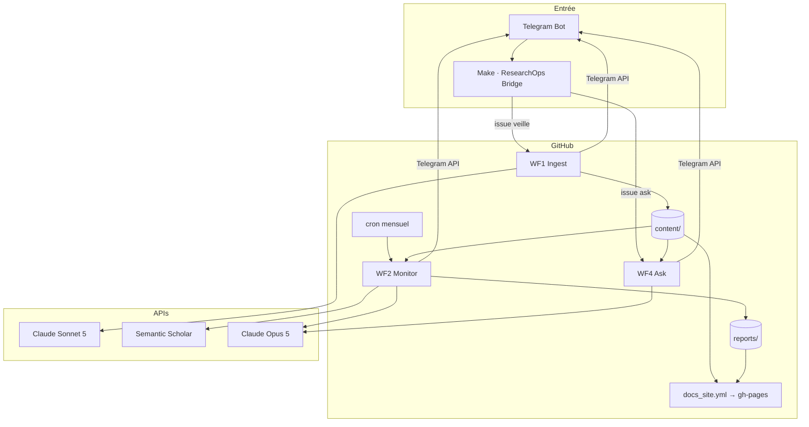

# Spécification technique : ResearchOps v1.2

**Projet** : ResearchOps — second cerveau R&D sans serveur
**Utilisateur cible** : responsable R&D / ingénieur docteur / data engineer
**Stack** : GitHub Actions · Python 3.11 · Claude (Sonnet 5 / Opus 5) · Semantic Scholar · Make.com · MkDocs Material
**Budget** : Make Free (0 €), GitHub Actions (dépôt public, 0 €), API LLM ≈ 2 à 10 €/mois selon volume
**Date** : septembre 2026 (v1.2 remplace la spec v1.1 de janvier 2025)

---

## 1. Principes

| Principe | Traduction concrète |
|---|---|
| Zéro infra | Aucun serveur, aucune base : git est le stockage, Actions l'exécuteur |
| Omnivore | URL, texte, capture d'écran, PDF, via Telegram |
| Qualité avant volume | Un garde-fou rejette ce qui n'a pas de contenu technique avant tout appel LLM |
| Citable | Tout rapport ou réponse cite des références fermées fournies au modèle |
| Restituable | La base se consulte (site avec recherche, Obsidian, questions via Telegram) |
| Build only what's unique | Deep research déléguée aux produits du marché ; WF3 retiré |

## 2. Architecture


```mermaid
graph TB
    subgraph Entrée
        TG[Telegram Bot] --> MK[Make · ResearchOps Bridge]
    end
    subgraph "GitHub"
        MK -->|issue veille| WF1[WF1 Ingest]
        MK -->|issue ask| WF4[WF4 Ask]
        CRON[cron mensuel] --> WF2[WF2 Monitor]
        WF1 --> C[(content/)]
        WF2 --> R[(reports/)]
        C --> WF2
        C --> WF4
        C --> SITE[docs_site.yml → gh-pages]
        R --> SITE
    end
    subgraph "APIs"
        WF1 --> CLS[Claude Sonnet 5]
        WF2 --> S2[Semantic Scholar]
        WF2 --> CL[Claude Opus 5]
        WF4 --> CL
    end
    WF1 & WF2 & WF4 -->|Telegram API| TG
```

## 3. Dépôt

```
.github/workflows/  wf1_daily_ingest.yml · wf2_monthly_monitor.yml · wf4_ask.yml · ci.yml · docs_site.yml
.github/ISSUE_TEMPLATE/  veille.md · ask.md
src/  wf1_ingest.py · wf2_monitor.py · wf4_ask.py · utils/{content_guard,dedup,frontmatter,git_ops,logger,notify}.py
config/  categories.json (taxonomie, seuils) · monitoring.json (thèmes académiques)
content/<Catégorie>/YYYYMMDD_<hash8>_<slug>.md
reports/<année>/<AAAA-MM>_Monitor.md
data/history.json  clés md5(url)[:8] et sha256(contenu)[:12]
scripts/build_site.py · mkdocs.yml · requirements.txt · requirements-docs.txt
tests/  pytest, exécuté par ci.yml
legacy/  WF3 Tri-Force, stub Triforce, multimodal.py (retirés, à supprimer)
```

## 4. Pont Make (Telegram → GitHub)

Un scénario, 4 routes, appels `POST /repos/yajeddig/ResearchOps/issues` via module HTTP avec **clé Make** (API Key Auth, header `Authorization: Bearer <fine-grained PAT, scope issues:write>`). Détails : `docs/make_setup.md`.

| Route | Condition | Label |
|---|---|---|
| Photo | `message.photo` existe | `veille` |
| Document | `message.document` existe | `veille` |
| Question | `message.text` commence par `?` | `ask` |
| Texte | sinon | `veille` |

## 5. WF1 · Ingest

- Déclencheur : `issues.labeled` = `veille`, auteur OWNER/COLLABORATOR/MEMBER.
- Routage : `IMG_ID:` → image ; `DOC_ID:` → document (texte lu directement si .md/.txt/.csv/.json, sinon PDF envoyé à Claude en pièce jointe) ; URL → `normalize_url` puis Jina Reader ; sinon note.
- Garde-fou (`content_guard` + `pii_guard`) : HTTP ≥ 400, marqueurs 404/anti-bot/login, < 500 caractères, note < 20 caractères, données personnelles (NIR/IBAN/carte/mots-clés RH) → `rejected` / `rejected_pii`.
- Dédup : URL et hash de contenu → `duplicate`.
- Analyse : Claude Sonnet 5, sortie structurée forcée via tool use (titre, catégorie, confiance, corps détaillé, insights, références, tags).
- Routage de confiance : `< 0.3` rejet ; `0.3–0.6` `_Inbox` ; `≥ 0.6` catégorie.
- Sortie : fiche YAML + Markdown, commit + push avec retry, `status`/`message` dans `$GITHUB_OUTPUT`, issue fermée avec commentaire, Telegram.

## 6. WF2 · Monitor

- Déclencheur : cron `0 6 1 * *`, `workflow_dispatch`.
- Interne : fiches datées du mois précédent, référencées `[I n]`.
- Externe : Semantic Scholar par `keywords_academic`, période = mois précédent, dédup via `history.json`, `paper_limit` par thème, référencées `[P n]`. Seuls les papiers rapportés sont marqués vus.
- Synthèse : Claude Opus 5, bibliographie fermée recopiée en fin de rapport. Aucun rapport si aucune donnée.
- Sortie : `reports/<année>/<mois de génération>_Monitor.md`, Telegram avec lien.

## 7. WF4 · Ask

- Déclencheur : `issues.labeled` = `ask`.
- Étape 1 : index compact de toutes les fiches → Claude (effort low) sélectionne ≤ 8 fiches.
- Étape 2 : Claude Opus 5 répond en français à partir des fiches, citations `[C n]`, section Sources.
- Sortie : commentaire d'issue, Telegram (≤ 3 500 caractères + lien), issue fermée. Pas de commit.

## 8. Site

`docs_site.yml` : `build_site.py` assemble `site_src/`, `mkdocs build --strict`, `mkdocs gh-deploy`. Activation Pages sur `gh-pages` à faire une fois. Recherche, tags, LaTeX, Mermaid.

## 9. Secrets

| Secret | Utilisé par |
|---|---|
| `ANTHROPIC_API_KEY` | WF1, WF2, WF4 |
| `TELEGRAM_BOT_TOKEN`, `TELEGRAM_CHAT_ID` | WF1, WF2, WF4 |
| `SEMANTIC_SCHOLAR_API_KEY` (optionnel) | WF2 |
| `GITHUB_TOKEN` (automatique) | fermeture et commentaires d'issues |

Retirés : `SERPAPI_KEY`, `PERPLEXITY_API_KEY`, `TAVILY_API_KEY`, `OPENAI_API_KEY`.

## 10. Qualité

- `ci.yml` exécute pytest sur chaque push/PR touchant le code.
- Logs JSON en CI via `utils/logger.py`.
- Modèle configurable par variable (`CLAUDE_MODEL`, un défaut par process : `claude-sonnet-5` en WF1, `claude-opus-5` en WF2/WF4) pour suivre les mises à jour sans toucher au code.

## 11. Évolutions envisagées

- Index vectoriel pour WF4 au-delà de quelques centaines de fiches.
- Alertes Google Scholar relayées au bot pour compléter Semantic Scholar.
- Passage du dépôt en privé si la base ne doit plus être publique (le site Pages deviendrait payant).
