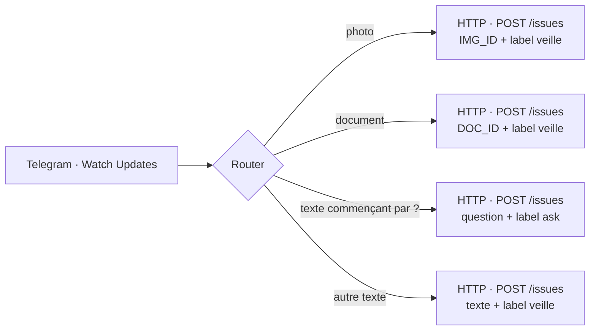

# Make.com : pont Telegram → GitHub

Le scénario **ResearchOps Bridge** écoute le bot Telegram et crée des issues GitHub. GitHub Actions fait le reste.

## Prérequis

- Bot Telegram (BotFather) et sa connexion Make `ResearchOps_bot`.
- **Token GitHub fine-grained** limité au dépôt `ResearchOps`, permission *Issues : Read and write* uniquement, expiration 1 an.
- Plan Make Free : 2 scénarios actifs, 1 000 opérations/mois. Le pont consomme 2 opérations par message.

## Sécurité du token

Le token ne doit **jamais** apparaître dans un module HTTP (header `Authorization` en clair) : il est alors lisible par toute intégration ayant accès au scénario et non révocable depuis Make.

Stockez-le dans une **clé Make** (*Keys → Add key → API Key Auth*) :

| Champ | Valeur |
|---|---|
| Key | `Bearer github_pat_…` |
| API key placement | Header |
| API key parameter name | `Authorization` |

Puis, dans chaque module HTTP « Make a request » : *Authentication type = API key*, *Credentials = la clé*. Supprimez le header `Authorization` du module.

## Modules du scénario

| Route | Filtre | Titre de l'issue | Corps | Labels |
|---|---|---|---|---|
| Photo | `message.photo` existe | `IMG_ID: {{get(last(1.message.photo); "file_id")}}` + `CAPTION:` | texte | `veille` |
| Document | `message.document` existe | `📄 [DOC] {{file_name}}` | `DOC_ID: {{file_id}}`, `MIME:` | `veille` |
| **Question** | `message.text` commence par `?` | `Ask: {{trim(substring(1.message.text; 1))}}` | vide | `ask` |
| Texte | `message.text` existe, pas de photo, ne commence pas par `?` | 200 premiers caractères | texte | `veille` |

Point d'entrée API : `POST https://api.github.com/repos/yajeddig/ResearchOps/issues`, body JSON `{title, body, labels}`, header `Accept: application/vnd.github+json`.

## Pourquoi HTTP plutôt que le module GitHub natif

Les modules GitHub de Make ne fonctionnaient pas lors de la mise en place initiale. L'appel HTTP est plus explicite et se met à jour sans dépendre de l'application Make. Le seul point à respecter est le stockage du token en clé.

## Fichiers volumineux

Make ne transfère pas les fichiers : il passe le `file_id` Telegram. `src/wf1_ingest.py` télécharge le fichier directement depuis l'API Telegram, sans limite de taille côté Make.

## Notifications retour

Les retours vers Telegram (statut d'ingestion, lien du rapport mensuel, réponses aux questions) sont envoyés par les workflows GitHub Actions directement via l'API Telegram (`utils/notify.py`). Aucun scénario Make supplémentaire n'est nécessaire.
