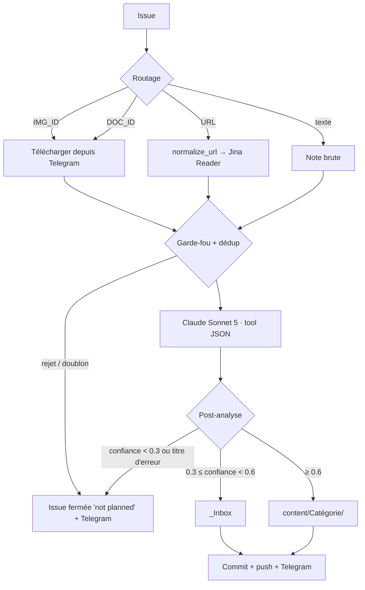

# WF1 : Ingestion omni-canal

**But** : transformer toute entrée (URL, texte, image, PDF) en fiche Markdown classée.

## Déclencheur

Issue GitHub recevant le label `veille` (`issues: labeled`). Make pose le label à la création, ce qui suffit ; l'événement `opened` n'est plus écouté car il doublait chaque run.

Seuls OWNER / COLLABORATOR / MEMBER déclenchent le workflow.

## Pipeline (`src/wf1_ingest.py`)

## Garde-fou qualité (`utils/content_guard.py`)

| Étape | Règle | Effet |
|---|---|---|
| URL | Déballage des redirections LinkedIn `safety/go/?url=`, Facebook, Google | Jina reçoit la vraie URL |
| Scraping | Code HTTP ≥ 400, page vide, marqueurs 404 / anti-bot / login, texte < 500 caractères | Rejet **avant** l'appel LLM |
| Note | Texte < 20 caractères | Rejet |
| Post-LLM | Confiance < `reject_threshold` (0.3) ou titre du type « Page Not Found », « Unavailable » | Rejet, aucune fiche |

Avant ce garde-fou, 21 % des fiches étaient des pages d'erreur.

## Déduplication (`utils/dedup.py`)

- URL : clé `md5(url)[:8]` (format historique conservé).
- Contenu : clé `sha256(bytes)[:12]` sur le texte scrapé, l'image ou le PDF. Un même document envoyé deux fois est détecté même sans URL.
- Le hash de contenu sert aussi de nom de fichier (`YYYYMMDD_<hash8>_<slug>.md`).

## Fiche produite

Frontmatter YAML (`title`, `date`, `category`, `confidence`, `tags`, `source`, `type`, `source_type`, `hash`) puis sections Relevance, Content, Key Insights, References, Classification.

## Sorties du job

Le script écrit `status` (`saved` / `duplicate` / `rejected` / `failed`) et `message` dans `$GITHUB_OUTPUT`. L'étape suivante ferme l'issue avec le commentaire adapté et une notification Telegram est envoyée dans tous les cas.

## Variables

`ANTHROPIC_API_KEY`, `TELEGRAM_BOT_TOKEN`, `TELEGRAM_CHAT_ID`, `GITHUB_TOKEN` (fourni par Actions), `CLAUDE_MODEL` (optionnel, défaut `claude-sonnet-5`).
